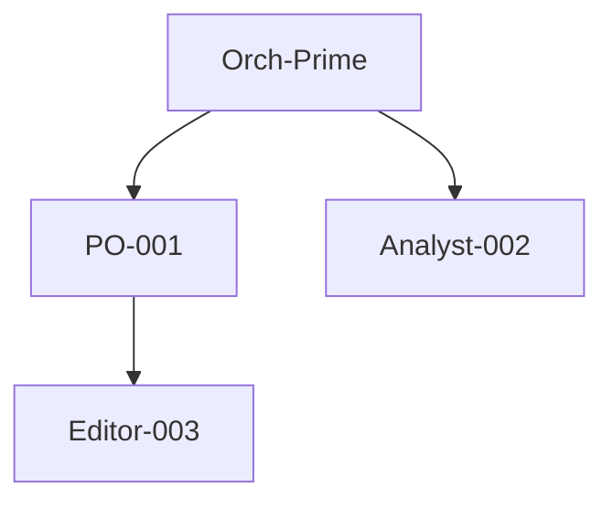

# /audit Command

Provides on-demand analysis of agent orchestration flows using the Sentinel Protocol.

## Usage

```
/audit <scope> [options]
```

## Scopes

| Scope | Description |
|-------|-------------|
| `session` | Full audit of current session |
| `agent <id>` | Audit specific agent |
| `task <id>` | Audit specific task |
| `flow` | Delegation flow visualization |
| `anomalies` | List all detected anomalies |
| `health` | Calculate health score |
| `config` | Show current configuration |
| `compliance` | Check hook compliance |

## Options

| Option | Description |
|--------|-------------|
| `--verbose` | Include full trace details |
| `--export` | Export to markdown file |
| `--since <timestamp>` | Filter by time |
| `--severity <level>` | Filter by severity (HIGH/MEDIUM/LOW) |

## Examples

```
/audit session              # Full session audit
/audit health               # Health score only
/audit anomalies --severity HIGH
/audit agent Claude-PO-c614-001
/audit flow                 # Delegation flow diagram
```

## Output

### Health Score
```
┌────────────────────────────────────────────────────────────┐
│   HEALTH SCORE: 92/100                                     │
│   ████████████████████░░░░░░░░░░  92%                     │
│   Status: GOOD                                             │
└────────────────────────────────────────────────────────────┘
```

### Delegation Flow (Mermaid)

