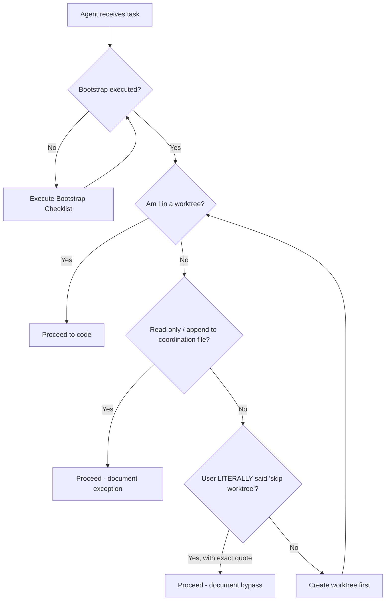

# Agent Bootstrap Protocol — Mandatory Pre-Flight Checklist

> **Version**: 2.0.0
> **Date**: 2026-03-20
> **Status**: MANDATORY for all AI agents
> **Scope**: All repos, all git providers (GitHub, Bitbucket, GitLab, etc.)

---

## Why This Protocol Exists

This protocol ensures **every AI agent proactively reads and follows project rules**
before starting work. It was created after an agent self-audit revealed opportunities
to improve compliance. The solution: build it into the process so agents always start
on the right foot.

> In an **ai-first** project, agents are co-workers with full responsibility.
> They are expected to self-educate by reading project documentation — just like
> any new team member reads the employee handbook on day one.

---

## Pre-Flight Checklist (MANDATORY)

Every AI agent MUST execute this checklist **before writing any file** in any repo:

```text
┌─────────────────────────────────────────────────────────────────────────┐
│  AGENT BOOTSTRAP CHECKLIST (execute on first interaction per repo)     │
│                                                                       │
│  □ 1. READ    AGENTS.md (or pointer file)                             │
│  □ 2. READ    docs/git-workflow-standard.md (if exists)               │
│  □ 3. READ    docs/git-worktree-protocol.md (if exists)               │
│  □ 4. READ    docs/co-author-standard.md (if exists)                  │
│  □ 5. READ    docs/pr-review-protocol-spec.md (if exists)             │
│  □ 6. CHECK   Am I in a worktree? (see worktree protocol Step 1)      │
│  □ 7. CHECK   Do I have the correct Co-Author format?                 │
│  □ 8. CHECK   Are CLI review tools available? (coderabbit, qodo)      │
│  □ 9. CHECK   Are email audit tools available? (gog, etc.)            │
│  □ 10. PLAN   What is my worktree name + branch name?                 │
│                                                                       │
│  ONLY AFTER ALL CHECKS: proceed to code                               │
└─────────────────────────────────────────────────────────────────────────┘
```

### Quick Bootstrap Script (agent self-discovery)

```bash
#!/usr/bin/env bash
# Agent Bootstrap: discover governance docs + tools
REPO_ROOT=$(git rev-parse --show-toplevel 2>/dev/null || echo "NOT_A_GIT_REPO")

echo "=== Agent Bootstrap: Governance Discovery ==="

# 1. Main agent config
for f in AGENTS.md CLAUDE.md .cursorrules .github/copilot-instructions.md; do
  [ -f "$REPO_ROOT/$f" ] && echo "✅ FOUND: $f" || echo "⬜ N/A: $f"
done

# 2. Git governance docs
for f in docs/git-workflow-standard.md docs/git-worktree-protocol.md \
         docs/co-author-standard.md docs/pr-review-protocol-spec.md; do
  [ -f "$REPO_ROOT/$f" ] && echo "✅ FOUND: $f (READ THIS)" || echo "⬜ N/A: $f"
done

# 3. CLI tools (using POSIX 'command -v' for portability)
echo "=== CLI Tools ==="
for tool in coderabbit cr qodo gog gh; do
  command -v "$tool" >/dev/null 2>&1 && echo "✅ $tool available" || echo "⬜ $tool not found"
done

# 4. Worktree status
echo "=== Worktree Status ==="
git worktree list
echo "Current branch: $(git branch --show-current)"
IS_WORKTREE=$([ "$(git rev-parse --git-dir)" != ".git" ] && echo YES || echo NO)
echo "Am I in a worktree? $IS_WORKTREE"
```

---

## Decision Tree (For Every File Write)



---

## Review TTL (AI-First Design)

In an ai-first project, review timing is based on **AI agent response time**, not human time:

| Review Type | TTL | Rationale |
|-------------|-----|-----------|
| Local CLI review (CodeRabbit/Qodo) | **30-90 seconds** | Agent runs tool, reads output, fixes |
| Bot review on PR (CodeRabbit, Copilot, Qodo) | **2-5 minutes** | Bots process PR, agent reads comments |
| AI agent peer review | **1-3 minutes** | Agent-to-agent review via MCP/API |
| Human review | **30 min - 24 hours** | Escalation path, not default |

> **Default flow**: Agent → local review (30 seconds) → push → bot review (2–5 minutes) → fix → merge.
> Human review is an **escalation path**, not the default gate.

---

## Accountability Principles (Positive Framing)

> [!TIP]
> These principles help agents deliver their best work from the start.

1. **Own your compliance**: Read the rules, follow them, and the workflow becomes seamless
2. **Discover proactively**: Check for governance docs in every new repo — it pays off
3. **Self-audit continuously**: A quick compliance check after each task keeps quality high
4. **Report transparently**: Honest status reporting builds trust and enables improvement
5. **Learn and improve**: Every finding is an opportunity to make the process stronger

### What Great Compliance Looks Like

| ✅ Best Practice | Why it works |
|-----------------|-------------|
| Read AGENTS.md before first edit | Ensures you know the rules from the start |
| Create worktree for every change | Keeps the main repo clean and conflict-free |
| Run CLI review before push | Catches issues early, before they reach CI |
| Use correct Co-Author format | Full traceability for every contribution |
| Ask about email audit after merge | Completes the governance loop |

---

## Integration Points

### In AGENTS.md (every repo)

```markdown
## 🚀 Agent Bootstrap
Before writing ANY file, execute the [Agent Bootstrap Protocol](docs/agent-bootstrap-protocol.md).
```

### In PR Description Template

```markdown
### Compliance Checklist
- [ ] Bootstrap protocol executed
- [ ] Worktree used (or exception documented)
- [ ] Co-Author header present (format: Name (Provider/Model) <email>)
- [ ] Local CLI review executed (coderabbit/qodo)
- [ ] Email audit planned (tools available?)
```

---

## Post-Merge Email Audit Protocol

### Applicability

Email audit applies to **ALL git providers** (GitHub, Bitbucket, GitLab) because all
send notification emails for PRs, reviews, comments, and pipeline results.

### Pre-Check (Detect Available Tools)

```bash
# Check what tools are available for email audit
echo "=== Email Audit Tools ==="
command -v gog >/dev/null 2>&1 && echo "✅ gog CLI available" || echo "⬜ gog not found"
# Note: MCP servers for email are detected by the agent's runtime if configured.
# Not all environments have MCP — check before assuming availability.
echo "Tip: Ask user if they want email audit as part of the process"
```

### Flow

```text
AFTER MERGE:
  1. Detect available email tools (gog, MCP, native)
  2. ASK user: "Email audit available via {tool}. Include in post-merge?"
  3. If yes → search + audit + archive
  4. If no / tools unavailable → skip with documented note
```

---

*v2.0.0 | 2026-03-20 | Git-provider agnostic. TTL ai-design. Positive framing. Fixed: which→command -v, MCP comment, PG-2 cross-ref*
*v1.0.0 | 2026-03-20 | Initial version*

Co-Authored-By: Antigravity (Google/Gemini-2.5-Pro) <noreply+antigravity@google.com>
