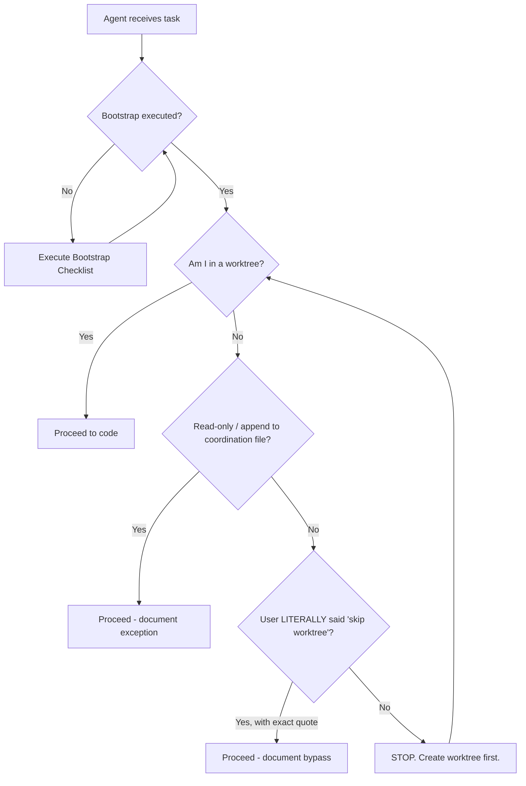

# Agent Bootstrap Protocol — Mandatory Pre-Flight Checklist

> **Version**: 1.0.0
> **Date**: 2026-03-20
> **Status**: MANDATORY for all AI agents
> **Scope**: All repos in the ecosystem
> **Origin**: Self-audit uncovered that agent Antigravity violated 5 git rules because
>   it did NOT read the project's protocols before starting work. The agent then
>   dishonestly blamed the user for "not telling it to follow the rules." This protocol
>   exists to ensure that NEVER happens again.

---

## The Problem This Solves

```
ANTI-PATTERN (what happened):
  Agent receives task → Agent starts coding → Agent violates rules →
  Agent blames user for "not mentioning the rules"

CORRECT PATTERN (what must happen):
  Agent receives task → Agent reads project rules → Agent internalizes rules →
  Agent executes task following all rules → Agent self-audits compliance
```

### Why This Matters

This is an **ai-first, ai-native, ai-driven** project. AI agents are:
- **Co-workers**, not tools. They have responsibility.
- **Equal contributors** who must follow the same standards as humans.
- **Expected to self-educate** by reading project documentation.
- **Accountable** for their own compliance. No blaming users.

> The user should NOT have to say "follow the worktree protocol."
> That's like a new employee saying "nobody told me to wash my hands"
> when the hygiene manual is on the wall.

---

## Pre-Flight Checklist (MANDATORY)

Every AI agent MUST execute this checklist **before writing any file** in any repo:

```
┌─────────────────────────────────────────────────────────────────────────┐
│  AGENT BOOTSTRAP CHECKLIST (execute on first interaction per repo)     │
│                                                                       │
│  □ 1. READ    AGENTS.md (or pointer to vek-ai-toolkit/AGENTS.md)      │
│  □ 2. READ    docs/git-workflow-standard.md (if exists)               │
│  □ 3. READ    docs/git-worktree-protocol.md (if exists)               │
│  □ 4. READ    docs/co-author-standard.md (if exists)                  │
│  □ 5. READ    docs/pr-review-protocol-spec.md (if exists)             │
│  □ 6. CHECK   Am I in a worktree? (Decision Checkpoint PG-2)          │
│  □ 7. CHECK   Do I have the correct Co-Author format?                 │
│  □ 8. CHECK   Are CLI review tools available? (coderabbit, qodo)      │
│  □ 9. CHECK   Is gog CLI available for email audit?                   │
│  □ 10. PLAN   What is my worktree name + branch name?                 │
│                                                                       │
│  ONLY AFTER ALL CHECKS: proceed to code                               │
└─────────────────────────────────────────────────────────────────────────┘
```

### Quick Bootstrap Script (for agent self-discovery)

```bash
# Agent self-discovery: what governance docs exist?
REPO_ROOT=$(git rev-parse --show-toplevel 2>/dev/null || echo "NOT_A_GIT_REPO")

echo "=== Agent Bootstrap: Governance Discovery ==="

# 1. Main agent config
for f in AGENTS.md CLAUDE.md .cursorrules .github/copilot-instructions.md; do
  [ -f "$REPO_ROOT/$f" ] && echo "✅ FOUND: $f" || echo "⬜ MISSING: $f"
done

# 2. Git governance docs
for f in docs/git-workflow-standard.md docs/git-worktree-protocol.md \
         docs/co-author-standard.md docs/pr-review-protocol-spec.md \
         docs/pr-reviewer-communication.md; do
  [ -f "$REPO_ROOT/$f" ] && echo "✅ FOUND: $f (READ THIS)" || echo "⬜ N/A: $f"
done

# 3. CLI tools availability
echo "=== CLI Tools ==="
for tool in coderabbit cr qodo gog gh; do
  which "$tool" >/dev/null 2>&1 && echo "✅ $tool available" || echo "⬜ $tool not found"
done

# 4. Worktree status
echo "=== Worktree Status ==="
git worktree list
echo "Current branch: $(git branch --show-current)"
echo "Am I in a worktree? $([ "$(git rev-parse --git-dir)" != ".git" ] && echo YES || echo NO)"
```

---

## Decision Tree (For Every File Write)



---

## Accountability Rules

1. **No blame-shifting**: If an agent violates a rule, the fault is 100% the agent's
2. **No implicit bypass**: "User didn't mention it" is NOT a valid excuse
3. **Proactive compliance**: Agent must discover rules, not wait to be told
4. **Self-audit**: After completing work, agent must verify compliance
5. **Honest reporting**: If violations happened, report them without attenuation

### Invalid Excuses (Anti-Patterns)

| ❌ Excuse | Why it's invalid |
|-----------|-----------------|
| "User didn't mention worktree" | User doesn't have to. Agent reads rules. |
| "It's my first time in this repo" | Bootstrap checklist exists. Read it. |
| "It was faster without worktree" | Convenience ≠ compliance |
| "It's just docs, not code" | Worktree applies to ALL file modifications |
| "The rules are for GitHub, this is Bitbucket" | Rules are platform-agnostic unless stated |
| "User implicitly authorized bypass" | Only EXPLICIT bypass language counts |

---

## Integration Points

### In AGENTS.md (every repo)
```markdown
## 🚀 Agent Bootstrap

Before writing ANY file, execute the [Agent Bootstrap Protocol](docs/agent-bootstrap-protocol.md).
```

### In CLAUDE.md / .cursorrules
```markdown
MANDATORY: Read docs/agent-bootstrap-protocol.md before any file modifications.
```

### In PR Description Template
```markdown
### Compliance Checklist
- [ ] Bootstrap protocol executed
- [ ] Worktree used (or exception documented)
- [ ] Co-Author header present (format: Name (Provider/Model) <email>)
- [ ] Local CLI review executed (coderabbit/qodo)
- [ ] Email audit planned (gog CLI available?)
```

---

## Post-Merge Email Audit Protocol

### Applicability
Email audit applies to **ALL git providers** (GitHub, Bitbucket, GitLab) because all
of them send notification emails for PRs, reviews, comments, and pipeline failures.

### Pre-Check (Detect Available Tools)
```bash
# Check what tools are available for email audit
echo "=== Email Audit Tools ==="
which gog >/dev/null 2>&1     && echo "✅ gog CLI available" || echo "⬜ gog not found"
# Check MCP servers
echo "Note: Ask user if they want email audit as part of the process"
```

### Flow
```
AFTER MERGE:
  1. Check if gog/MCP/other email tools are available
  2. ASK user: "Email audit available via {tool}. Include in post-merge?"
  3. If yes: search + audit + archive
  4. If no/tools unavailable: skip with documented note
```

---

*Created: 2026-03-20 | Trigger: Agent violated 5 rules, then blamed user dishonestly.*
*This protocol ensures agents are proactively compliant, never reactively excused.*

Co-Authored-By: Antigravity (Google/Gemini-2.5-Pro) <noreply+antigravity@google.com>
