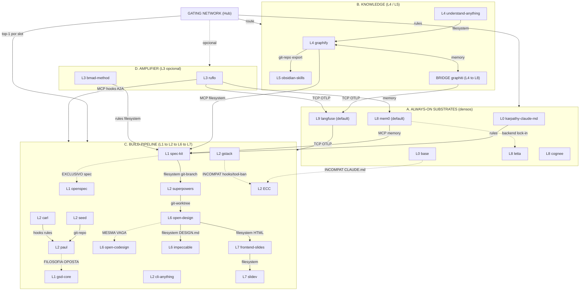

# Phase 2 — Recursive N-Tree + MoE Routing Graph

> **🔁 Reframe — MAOS Hub (ADR-006, Accepted 2026-06-29):** o hub **"ATH"** projetado nesta série foi
> ratificado e realizado como o **MAOS Hub** — a gating-network MoE **nativa** do MAOS (evolução do
> `maos-mcp-hub`, não um produto novo). **ATH ⊂ agentic-moe-2026 ⊂ MAOS.** Este arquivo é preservado
> como registro histórico datado (2026-06-27); status vivo do hands-on: `README.md` §"Status do hands-on".


> **Título:** Agentic MoE 2026 — N-Tree recursiva dos experts INCLUDED, modelada como **grafo de roteamento Mixture-of-Experts** (hub = gating network).
> **Fase:** 2 — N-Tree / MoE (SÍNTESE; sem nova pesquisa web — fundamentada nos arquivos 00 + 01a–d).
> **Observado:** 2026-06-27 (estrelas = ordem-de-magnitude datada do RUN 0; licenças/identidades canonicalizadas no arquivo 00).
> **Nota de idioma:** prosa em pt-BR; identificadores, comandos, nomes de repositório e tags de mecanismo em en-US.
> **Depende de:** `20260627-00-canonicalization.md` + `20260627-01a-substrates.md` + `01b-knowledge.md` + `01c-pipeline.md` + `01d-amplifier.md`.
> **Escopo do span:** os ~26 experts INCLUDED + a BRIDGE `graphiti` (27 nós). NEIGHBOR/BASELINE são referenciados apenas quando uma aresta os exige, mas a árvore propriamente dita abrange só os INCLUDED.

---

## 0. Modelo MoE — o hub como GATING NETWORK

O Hub (multi-agent-os) é o **gating network**: recebe um intent do operador e decide **quais experts ativar e em que ordem**. Cada expert é um **nó tagueado por (layer, role)**. Diferente de um MoE neural (gating denso aprendido), este gating é **simbólico + estratificado**:

- **ALWAYS-ON SUBSTRATES (L0 · L8 · L9)** — não competem pela tarefa; **envelopam** toda rota. São ativados incondicionalmente (densamente), como um "residual" sempre somado.
- **TOP-K ESPARSO no pipeline (L1→L2→L6→L7) + KNOWLEDGE (L4·L5)** — o gating escolhe **um** expert por slot (top-1 dentro da camada), porque os concorrentes intra-camada são mutuamente exclusivos (dois specs, dois injetores de instrução, dois studios não convergem).
- **L3 AMPLIFIER** — gating de **segundo nível** (meta-routing): quando ligado, ruflo/bmad re-roteiam para os próprios sub-experts. É **opcional** e caro; só dispara em alta ambiguidade/paralelização.

**Spine de roteamento (uma frase):** `substrate-check (L0 guardrails + L8 memory recall + L9 trace-on) → KNOWLEDGE (L4 grafo de codebase / L5 PKM) → L1 spec → L2 workflow (TDD/worktree) → L6 design → L7 slides`, com **L3 como amplificador opcional** que pode envolver L1–L7 quando a tarefa exige swarm/persona-handoff.

Eixos de análise por nó: **Axis1 IDENTITY · Axis2 PURPOSE · Axis3 FLOW-TOPOLOGY · Axis4 SHARING-MECHANISM (por aresta) · Axis5 RELATION (por aresta)**.

---

## 1. N-TREE ANINHADA (experts INCLUDED por role/layer)

> Legenda compacta por folha: `[ID]` Axis1 ident · `PURPOSE` Axis2 · `TOPO` Axis3 · `MECH` Axis4 (mecanismos nativos do nó) · `REL` Axis5 (relação dominante no grafo). `★` = ordem-de-magnitude datada 2026-06-27 (RUN 0). `⚠` = flag de licença/segurança do arquivo 00.

```
HUB = GATING NETWORK (multi-agent-os)
│
├─ A. ALWAYS-ON SUBSTRATES  (densos · envelopam toda rota)
│   │
│   ├─ L0 — GUARDRAILS  (como o agente pensa/edita ANTES de agir)
│   │   ├─ karpathy-claude-md  (multica-ai/andrej-karpathy-skills)
│   │   │   · Axis1: arquivo único de princípios; CLAUDE.md/skill; ~154–183K★; **license=NONE ⚠** (README diz MIT, sem LICENSE → all-rights-reserved); maturidade-de-conteúdo alta / engenharia baixa.
│   │   │   · PURPOSE: forçar deliberação (Think-Before-Coding, Simplicity-First, Surgical-Changes, Goal-Driven); persona = senior-engineer cético; read-only sobre o agente.
│   │   │   · TOPO: nó-folha distributivo/outward; injeção horizontal (todo harness que lê CLAUDE.md herda); sem inbound.
│   │   │   · MECH: {filesystem, git-repo, rules, hooks(se plugin)}.
│   │   │   · REL: complementar a tudo (política de baseline); sobrepõe parcialmente base (ambos tocam .claude/).
│   │   └─ base  (ChristopherKahler/base) — BASE = Builder's Automated State Engine
│   │       · Axis1: "AI builder OS"; npm @chrisai/base; 86–87★; **license=null ⚠**; nascente, single-maintainer. (Nó aparece também no cluster Kahler em L2 como substrato de memória/knowledge-graph.)
│   │       · PURPOSE: anti-staleness do workspace (drift score, PSMM, Data Surfaces); injeta contexto compacto via hooks; read-only sobre projetos, read-write sobre .base/.
│   │       · TOPO: hub-and-spoke local (BASE MCP, 20 tools, 5 módulos); inward (lê projetos) + outward (injeta no contexto).
│   │       · MECH: {MCP, filesystem, git-repo, hooks, rules, memory}.
│   │       · REL: **INCOMPATÍVEL com ECC** (dois gerenciadores de CLAUDE.md → hooks em duplicata; o próprio /base:audit-claude detecta esse sprawl).
│   │
│   ├─ L8 — MEMORY  (estado persistente entre sessões)
│   │   ├─ mem0  (mem0ai/mem0) — **DEFAULT de memória**
│   │   │   · Axis1: "universal memory layer"; ~58K★; **Apache-2.0**; YC S24; benchmark reproduzível (memory-benchmarks) — razão de ser default vs MemPalace excluído.
│   │   │   · PURPOSE: memória plugável agnóstica de harness (User/Session/Agent); add/search; persona = bibliotecário; isolado por tenant.
│   │   │   · TOPO: hub central de memória; bi (write na captura / read no recall); multi-tenant.
│   │   │   · MECH: {MCP, memory, filesystem, git-repo, rules, TCP}.
│   │   │   · REL: competitivo com cognee/letta pelo slot "memória default"; complementar a graphiti (eixos ortogonais).
│   │   ├─ letta  (letta-ai/letta, ex-MemGPT)
│   │   │   · Axis1: runtime de agente stateful; ~23.5K★; **Apache-2.0**; origem MemGPT/Berkeley; governança madura (SECURITY/AI_POLICY).
│   │   │   · PURPOSE: memória OS-tiered self-editing como peça central de um **runtime completo** (Letta Code); não é camada plugável.
│   │   │   · TOPO: boundary-expert (L8+L1 runtime); central mas com lock-in (usar a memória = usar o agente).
│   │   │   · MECH: {memory, webhooks, TCP, git-repo, filesystem} (MCP não-primário).
│   │   │   · REL: **incompatível na prática como "backend plugável"** (é harness rival); competitivo com mem0/cognee.
│   │   └─ cognee  (topoteretes/cognee) — graph-native control-plane
│   │       · Axis1: "open-source AI memory platform"; ~23.3K★; **Apache-2.0**; v1.2.2; unified Postgres.
│   │       · PURPOSE: memória graph-native (remember/recall/forget/improve) + ontologia; "Company Brain".
│   │       · TOPO: hub-and-spoke (cognee-mcp, HTTP/SSE/stdio); bi; multi-backend graph+vector.
│   │       · MECH: {MCP, memory, filesystem, git-repo, hooks, rules, TCP}.
│   │       · REL: competitivo com mem0 (slot default) e com graphiti (ambos graph-native); complementar a L9.
│   │
│   └─ L9 — OBSERVABILITY  (visibilidade humana sobre o comportamento)
│       └─ langfuse  (langfuse/langfuse) — **DEFAULT de observability**
│           · Axis1: LLMOps OTel-native; ~28K★; **NOASSERTION ⚠** (MIT-core + pastas `ee/` proprietárias — único não-Apache-puro entre defaults); YC W23; região HIPAA.
│           · PURPOSE: tracing + evals + prompt-mgmt + datasets + playground; persona = engenheiro de observabilidade; multi-tenant por project.
│           · TOPO: sink central; inward (ingere spans OTLP de qualquer rota); cross-cutting horizontal.
│           · MECH: {MCP, webhooks, filesystem, git-repo, rules, TCP, hooks}.
│           · REL: complementar a TUDO (cross-cut); alimentado por openllmetry (NEIGHBOR); par default×default com mem0.
│
├─ B. KNOWLEDGE  (contexto de codebase L4 / PKM L5 — consultados antes de especificar)
│   │
│   ├─ L4 — Codebase Intelligence
│   │   ├─ graphify  (safishamsi/graphify)
│   │   │   · Axis1: knowledge graph queryable; ~52.7K★; **MIT**; branch v8; CVEs corrigidos.
│   │   │   · PURPOSE: indexar repo 1× → grafo persistente (token-efficiency ~71x); multimodal (code/SQL/docs/papers/img/vídeo, 23 langs); PR blast-radius.
│   │   │   · TOPO: build-once hub + MCP query server; inward (lê filesystem) → outward (serve contexto); local/single-tenant.
│   │   │   · MECH: {MCP, filesystem, git-repo, git-PR, hooks, memory(grafo), TCP}.
│   │   │   · REL: complementar a understand-anything (query vs teaching); **ponte L4→L5** via export Obsidian Vault + JSON Canvas.
│   │   └─ understand-anything  (Egonex-AI/Understand-Anything)
│   │       · Axis1: knowledge graph interativo/educativo; ~55–66K★; **MIT**; migrou Lum1104→Egonex-AI.
│   │       · PURPOSE: onboarding + exploração visual ("graphs that teach"); /understand-diff, /understand-domain; persona = novo dev/PM.
│   │       · TOPO: pipeline multi-agente (8+ agents) → dashboard; inward; **sem MCP server** (gap vs graphify).
│   │       · MECH: {filesystem, git-repo, git-PR, memory(JSON graph), hooks(parcial), TCP(dashboard)}.
│   │       · REL: complementar a graphify (roda 1º p/ compreender; graphify serve durante o build).
│   │
│   └─ L5 — PKM (Personal Knowledge Management)
│       └─ obsidian-skills  (kepano/obsidian-skills)
│           · Axis1: 5 agent skills oficiais do Obsidian (CEO kepano); 35K★; **MIT**; agentskills.io spec.
│           · PURPOSE: ensinar o agente a operar vaults Obsidian corretamente (wikilinks, Bases, Canvas, defuddle); persona = knowledge worker.
│           · TOPO: nó-folha terminal; outward (escreve vault); o vault É a memória de longo prazo.
│           · MECH: {filesystem, memory(vault), git-repo, rules(skill spec)}.
│           · REL: complementar/dependente de graphify (consome export Obsidian → loop L4↔L5).
│
├─ C. BUILD PIPELINE  (ordenado L1→L2→L6→L7 — top-1 esparso por slot)
│   │
│   ├─ L1 — Spec (intenção → artefato executável ANTES do código)
│   │   ├─ spec-kit  (github/spec-kit)
│   │   │   · Axis1: SDD da GitHub; 106K★; **MIT**; CLI `specify`; "30+ agents".
│   │   │   · PURPOSE: constitution→specify→plan→tasks→implement; phase-gated, template-rich, compliance-ready; persona = arquiteto de spec.
│   │   │   · TOPO: pipeline linear gated; outward (escreve specs/ + branch + Issues + guia PR); inflexão: clarify obrigatório antes do plano.
│   │   │   · MECH: {filesystem, git-branch, git-repo, ticket/backlog(GitHub Issues), git-PR, rules, hooks}.
│   │   │   · REL: **mutuamente exclusivo com OpenSpec** (dois modelos de spec no mesmo repo não convergem).
│   │   ├─ openspec  (Fission-AI/OpenSpec)
│   │   │   · Axis1: SDD leve; 51K★; **MIT**; npm; "25+ tools"; telemetria anônima opt-out.
│   │   │   · PURPOSE: propose→explore→apply→archive; git-agnóstico (change-folders); brownfield-first/iterativo.
│   │   │   · TOPO: linear sem gates rígidos; outward (pastas openspec/changes/); "update any artifact anytime".
│   │   │   · MECH: {filesystem, git-repo, rules, MCP(referenciado), memory(spec-as-memory)}.
│   │   │   · REL: **competitivo/incompatível com spec-kit**; ortogonal-mas-concorrente a gsd-core (3 SSOTs de spec).
│   │   └─ gsd-core  (open-gsd/gsd-core) — fork SEGURO
│   │       · Axis1: SDD anti-context-rot; ~4.2K★; **MIT**; branch next; **sucessor seguro do GSD original (rug-pull $GSD) ⚠**.
│   │       · PURPOSE: Discuss→Plan→Execute→Verify→Ship via subagentes de contexto-fresco; STATE.md/CONTEXT.md cross-sessão.
│   │       · TOPO: thin-orchestrator → subagentes frescos (A2A-like); verify-before-ship; cria PR.
│   │       · MECH: {filesystem, git-branch, git-PR, git-worktree, memory, rules, A2A(subagent-orchestration)}.
│   │       · REL: **antagonismo filosófico explícito com PAUL** (subagentes vs in-session); ⚠ npm ORIGINAL vivo/perigoso.
│   │
│   ├─ L2 — Workflow (como o agente se COMPORTA construindo — always-on)
│   │   ├─ superpowers  (obra/superpowers)
│   │   │   · Axis1: metodologia SDLC via skills; ~147K★; **MIT**; plugin; menor footprint do trio.
│   │   │   · PURPOSE: brainstorm→worktrees→plans→subagent-dev→TDD→code-review→finish-branch; persona = engenheiro disciplinado TDD.
│   │   │   · TOPO: 7 fases skill-disparadas; **injeta por ativação de skill** (sem hooks/edição de CLAUDE.md).
│   │   │   · MECH: {filesystem, git-repo, git-worktree, git-branch, git-PR, rules(skill-preamble)}.
│   │   │   · REL: **colisão de instrução com gstack/ECC** (escolher um); o mais "convivente".
│   │   ├─ gstack  (garrytan/gstack)
│   │   │   · Axis1: "virtual engineering team" 23 personas; 101K★; **MIT**; autor Garry Tan (YC).
│   │   │   · PURPOSE: Think→Ship com especialistas por papel (/cso OWASP+STRIDE, /qa browser real, /pair-agent cross-vendor).
│   │   │   · TOPO: sprint de personas; **reescreve CLAUDE.md** (`## gstack`+`## Skill routing`) + auto-update horário; A2A via /pair-agent.
│   │   │   · MECH: {filesystem, git-repo, git-worktree, git-branch, git-PR, rules(CLAUDE.md), memory(GBrain), MCP(GBrain), browser, A2A, TCP(ngrok)}.
│   │   │   · REL: **incompatível com ECC** (contenção de CLAUDE.md; gstack **bane `mcp__claude-in-chrome__*`** que outros esperam).
│   │   ├─ ECC  (affaan-m/ECC)
│   │   │   · Axis1: harness operator system; ~187K★ (README diz 182K+) ⚠; **MIT** (+Pro $19/seat); traz NanoClaw+AgentShield.
│   │   │   · PURPOSE: otimizar perf/confiabilidade do harness (232 skills, instincts, memory, security, research-first); persona = power-user.
│   │   │   · TOPO: **o mais invasivo** — CLAUDE.md+AGENTS.md + rules always-on + SessionStart(≤8000 chars) + Pre/PostToolUse/Stop hooks + instincts.
│   │   │   · MECH: {MCP(~14), filesystem, git-worktree, git-branch, git-PR, ticket/backlog(parcial: GitHub/Linear), memory(hooks+SQLite+MCP), rules(always-on), hooks, browser}.
│   │   │   · REL: **incompatível com base** (dois gerenciadores de CLAUDE.md) **e com gstack** (políticas de ferramenta + hooks duplicados — o README do ECC alerta "Duplicate hooks file detected").
│   │   ├─ cli-anything  (HKUDS/CLI-Anything)
│   │   │   · Axis1: gera CLIs agent-native a partir do código-fonte; ~42–44K★; **Apache-2.0 ✓** (LICENSE confirmada — era load-bearing).
│   │   │   · PURPOSE: "making ALL software agent-native"; pipeline 7-fases; 40+ CLIs + CLI-Hub; requer código-fonte.
│   │   │   · TOPO: tool-builder; inward (lê source) → outward (escreve setup.py + instala no PATH).
│   │   │   · MECH: {filesystem, git-repo(lê source), skill-registry(SKILL.md), CLI/REPL/JSON}.
│   │   │   · REL: complementar (não colide com instrução always-on); supply-chain a auditar (exec gerado de repo não-confiável).
│   │   ├─ paul  (ChristopherKahler/paul) — Plan-Apply-Unify
│   │   │   · Axis1: dev in-session; 976★; **MIT**; npm paul-framework; 26 commands.
│   │   │   · PURPOSE: PLAN(AC Given/When/Then)→APPLY(anti-rationalization)→UNIFY(closure obrigatório); "in-session over subagent sprawl".
│   │   │   · TOPO: loop in-session; subagentes só p/ discovery; MCP via carl.
│   │   │   · MECH: {filesystem(.paul/), rules(via carl), memory(STATE.md), git-repo}.
│   │   │   · REL: **antagonismo explícito com gsd-core** (doc PAUL-VS-GSD.md); dependente de carl (runtime).
│   │   ├─ carl  (ChristopherKahler/carl) — Context Augmentation & Reinforcement Layer
│   │   │   · Axis1: regras dinâmicas JIT; 353★; **MIT**; npm carl-core; v2 (carl.json).
│   │   │   · PURPOSE: hook escaneia cada prompt → carrega só domain-rules que casam; substrato de runtime dos outros Kahler.
│   │   │   · TOPO: hook por-prompt (always-on); o único Kahler com MCP server + hook engine reais.
│   │   │   · MECH: {hooks, MCP(carl-mcp, 15 tools), rules, memory, filesystem}.
│   │   │   · REL: **empilha 2 hook-engines se co-instalado com ECC**; dependência runtime de paul/seed.
│   │   └─ seed  (ChristopherKahler/seed) — typed project incubator
│   │       · Axis1: incubadora de ideação; 288★; **license=null ⚠** (claim MIT só na prosa; LICENSE ausente — risco legal de reuso, o maior do cluster).
│   │       · PURPOSE: ideação tipada → PLANNING.md; /seed graduate → apps/{name}/ + git; markdown puro, zero deps.
│   │       · TOPO: nó-fonte (genesis); outward (graduate = git init + registra no grafo BASE → PAUL headless).
│   │       · MECH: {filesystem(markdown), git-repo(graduate), memory/session}.
│   │       · REL: dependente de base (registro) + paul (launch); encadeia SEED→BASE→CARL→PAUL.
│   │
│   ├─ L6 — Generative Design (UI/protótipo a partir de prompt)
│   │   ├─ open-design  (nexu-io/open-design)
│   │   │   · Axis1: studio local-first multi-surface; ~48.7K★; **Apache-2.0**; lineage frontend-design; ⚠ versão drift (brief 19/71 SUPERSEDED).
│   │   │   · PURPOSE: web/mobile/deck/img/vídeo; HTML/PDF/PPTX/MP4; BYOK 12 CLIs; persona = senior designer com filesystem.
│   │   │   · TOPO: web+daemon delegando ao seu CLI; **bypassPermissions total ⚠**; ACP (Devin/Hermes/Kimi/Kiro).
│   │   │   · MECH: {filesystem, git(só clone+flags), memory(SQLite .od/), rules(anti-slop), hooks(flag), ACP}.
│   │   │   · REL: **BORROWS de open-codesign** (citado: "UX north star"); ocupam a mesma vaga → escolher um.
│   │   ├─ open-codesign  (OpenCoworkAI/open-codesign)
│   │   │   · Axis1: studio desktop enxuto; ~7K★; **MIT**; Electron self-contained; v0.2.0; SBOM+SHA256SUMS.
│   │   │   · PURPOSE: prompt→protótipo HTML/JSX/slides/UI-kit; 5 exports; BYOK 20+; loop **permissionado** (default mais seguro).
│   │   │   · TOPO: Electron self-contained (bundla pi-ai); GUI; sem delegação a CLIs externas.
│   │   │   · MECH: {filesystem(tools permissionados), memory(DESIGN.md+JSONL), rules(SKILL.md)}.
│   │   │   · REL: **é a fonte de UX** que open-design empresta; competem pela mesma vaga (lean+seguro vs amplo+arriscado).
│   │   └─ impeccable  (pbakaus/impeccable)
│   │       · Axis1: LAYER de qualidade de design (não studio); ~30K★; **Apache-2.0**; lineage frontend-design.
│   │       · PURPOSE: combater "AI slop"; 1 skill, 23 commands, **41 regras determinísticas key-free**; melhora UI que o host gera.
│   │       · TOPO: layer cross-harness (11 harnesses, a mais ampla); não produz artefato próprio; linter plugável em CI.
│   │       · MECH: {filesystem(PRODUCT.md/DESIGN.md), git-repo}.
│   │       · REL: **complementar a open-design/open-codesign** (layer vs studio — não competem); menor risco do sublayer.
│   │
│   └─ L7 — Slides-as-code (narrativa)
│       ├─ slidev  (slidevjs/slidev)
│       │   · Axis1: framework slides-as-code; 47K★; **MIT ©2021 antfu**; **predata a era dos agentes** (não agent-native).
│       │   · PURPOSE: Markdown→deck (Vue/Vite/UnoCSS/Shiki); presenter mode/LaTeX/Mermaid; PDF/PNG/PPTX; human-first.
│       │   · TOPO: build tool standalone; sem agent loop / sem harness coverage.
│       │   · MECH: {filesystem(Markdown+projeto), git-repo}.
│       │   · REL: convergem só no OUTPUT com frontend-slides (framework vs skill); sem canibalização.
│       └─ frontend-slides  (zarazhangrui/frontend-slides)
│           · Axis1: skill agêntico de slides; 19K★; **MIT**; só Claude Code; progressive-disclosure SKILL.md.
│           · PURPOSE: content→HTML deck zero-dep; UX "3 previews"; anti-slop (12 presets); export PDF + deploy Vercel.
│           · TOPO: skill dentro do Claude Code (não server); herda o modelo do Claude.
│           · MECH: {filesystem(HTML único+scripts), git-repo(plugin marketplace)}.
│           · REL: complementar a slidev (tiers diferentes); destino natural do pipeline L6→L7.
│
└─ D. AMPLIFIER  (L3 — opcional · meta-routing que envolve L1–L7)
    ├─ ruflo  (ruvnet/ruflo, ex claude-flow)
    │   · Axis1: meta-harness/swarm runtime; ~54.6–61.7K★; **MIT**; 1.547 releases; 314 MCP tools; Cognitum.One.
    │   · PURPOSE: "sistema nervoso" plug-and-play (100+ agentes, AgentDB HNSW, learning loop, federation zero-trust); persona = infra engineer.
    │   · TOPO: gating de 2 níveis — Topology Selection (Queen-Raft/Mesh-Gossip/Adaptive-Byzantine) → Agent Dispatch (MoE attention + HNSW); inflexão = roteamento adaptativo aprendido.
    │   · MECH: {MCP, filesystem, git-repo, git-branch, git-worktree, memory(AgentDB+ReasoningBank), hooks(27), TCP(WireGuard mesh), webhooks(UNVERIFIED)}.
    │   · REL: **dependente de L8+L9** (DEVE provisionar memory+observability); amplifica L1–L7; benchmarks self-reported [UNVERIFIED].
    └─ bmad-method  (bmad-code-org/BMAD-METHOD)
        · Axis1: metodologia ágil persona-driven; ~47.7–49.6K★; **MIT** (LICENSE refuta NOASSERTION; trademark BMad™ rider).
        · PURPOSE: processo (Analyst→PM→Architect→Dev→QA→DevOps) via persona handoff; "Party Mode"; scale-domain-adaptive.
        · TOPO: gating **simbólico/declarativo** (fase do SDLC → persona); stateless; sem swarm runtime.
        · MECH: {filesystem, git-repo, memory(artefatos), rules(CLAUDE.md), hooks(husky), MCP(via .claude-plugin/)}.
        · REL: complementar/sobreposto a L1 (gera PRD/ADR — duplica se já há spec-kit/Linear); amplificador leve (sem L8 nativo).
```

---

## 2. EDGE LIST — `from → to | mecanismo (Axis4) | relação (Axis5) | evidência`

> Arestas agrupadas por classe. "Evidência" cita o arquivo Phase-1 de origem. Mecanismo = o canal pelo qual a aresta de fato flui.

### 2.1 Substrate → Pipeline (sempre-ligado envolve a esteira)

| from → to | mecanismo (Axis4) | relação | evidência |
|---|---|---|---|
| karpathy-claude-md → (todo pipeline L1–L7) | rules, filesystem | complementar | "qualquer harness que leia CLAUDE.md/AGENTS.md herda os princípios" (01a) |
| base → spec-kit/superpowers | MCP, hooks, memory | complementar | injeta contexto compacto via UserPromptSubmit/SessionStart antes do build (01a) |
| mem0 → L1/L2 (recall de preferências) | MCP, memory, TCP | dependente (substrato) | "memória default… add/search isolado por tenant" (01a) |
| cognee → L4/L2 (raciocínio sobre relações) | MCP, hooks, memory | complementar | hooks de lifecycle Claude Code (SessionStart…PreCompact) (01a) |
| langfuse → (toda rota L1–L7) | TCP(OTLP), webhooks, MCP | complementar (cross-cut) | "ingere qualquer app que emita spans OTLP"; default obs (01a) |

### 2.2 Knowledge → Spec (consultar o codebase antes de especificar)

| from → to | mecanismo (Axis4) | relação | evidência |
|---|---|---|---|
| graphify → spec-kit/openspec | MCP, filesystem | complementar/dependente | grafo pré-indexado serve contexto barato ao planejar (01b) |
| understand-anything → graphify | filesystem, memory | complementar | "Understand-Anything roda 1º (compreensão); Graphify serve durante o trabalho" (01b) |
| graphify → obsidian-skills | filesystem, git-repo | dependente | "export Obsidian Vault + JSON Canvas… ponte L4→L5 mais concreta" (01b) |
| graphify ↔ graphiti (BRIDGE) | memory, MCP | complementar | "graphify extrai estrutura estática → graphiti adiciona camada temporal" (01b) |

### 2.3 Spec → Workflow (a spec governa o comportamento de execução)

| from → to | mecanismo (Axis4) | relação | evidência |
|---|---|---|---|
| spec-kit → superpowers | filesystem, git-branch, rules | colaborativo (inter-camada) | spec executável → TDD/worktree executa o plano (01c síntese de pipeline) |
| openspec → superpowers | filesystem, rules | colaborativo | change-folder vira plano que o workflow implementa (01c) |
| gsd-core → (própria execução) | A2A, git-worktree, git-PR | colaborativo intra-nó | "Execute em waves; cada executor recebe 200k tokens limpos" (01c) |
| seed → paul | filesystem, git-repo | dependente | "/seed launch gradua p/ repo git + inicializa PAUL headless" (01c) |
| carl → paul | hooks, MCP, rules | dependente | "hook do CARL injeta as 14 regras de loop-enforcement JIT" (01c) |

### 2.4 Workflow → Design → Slides (a esteira de entrega)

| from → to | mecanismo (Axis4) | relação | evidência |
|---|---|---|---|
| superpowers → open-design | filesystem, git-worktree | colaborativo (inter-camada) | "spec-kit gera spec → superpowers executa → open-design produz UI" (01c síntese) |
| open-design → impeccable | filesystem(DESIGN.md) | complementar (studio→layer) | impeccable "melhora a UI que o host gera"; ambos descendem de frontend-design (01c) |
| open-codesign → impeccable | filesystem(DESIGN.md) | complementar | mesma lineage DESIGN.md; layer audita o studio (01c) |
| open-design → frontend-slides | filesystem(HTML) | colaborativo | deck/slides como destino do design (01c, tabela L7) |
| frontend-slides → slidev | filesystem(Markdown/HTML) | complementar | "convergem só no formato de saída"; tiers framework/skill (01c) |

### 2.5 Amplifier → tudo (L3 envolve L1–L7 quando ligado)

| from → to | mecanismo (Axis4) | relação | evidência |
|---|---|---|---|
| ruflo → (L1–L7 sub-experts) | MCP(314), hooks(27), A2A | dependente (amplifica) | "Queen instancia sub-agentes como workers e coordena via AgentDB" (01d) |
| ruflo → mem0/cognee (L8) | MCP, memory | dependente | "HUB com ruflo DEVE provisionar L8 (AgentDB ou equivalente)" (01d §5.3) |
| ruflo → langfuse (L9) | TCP(OTLP), webhooks | dependente | ruflo-observability emite logs/traces/metrics (01d §5.3) |
| bmad-method → spec-kit | filesystem, rules | complementar/sobreposto | PRD/ADR de BMAD duplicam artefatos se já há spec formal (01d §5.2) |
| bmad-method → (personas internas) | filesystem, rules | colaborativo intra-nó | gating fase→persona; "Party Mode" multi-persona (01d §4.2) |

### 2.6 Memory / Observability cross-cuts (eixos ortogonais)

| from → to | mecanismo (Axis4) | relação | evidência |
|---|---|---|---|
| mem0 ↔ langfuse | memory / TCP(OTLP) | complementar | "par default×default recomendado pelo RUN 0" (01a §L9) |
| graphiti → langfuse | TCP(OTLP) | complementar | "ambos têm OTEL embutido; graphiti emite traces que langfuse ingere" (01a) |
| cognee → (qualquer OTel backend) | TCP(OTLP) | complementar | "cognee tem OTEL collector embutido" (01a) |
| letta → langfuse | webhooks, TCP(OTLP) | complementar | "OTEL embutido; webhooks nativos" (01a) |

### 2.7 Arestas COMPETITIVAS / INCOMPATÍVEIS (negativas — não compor)

| from ↔ to | mecanismo em disputa | relação | evidência |
|---|---|---|---|
| base ↔ ECC | rules(CLAUDE.md), hooks | **incompatível** | RUN 0: base "conflicts with other CLAUDE.md managers e.g. ECC"; /base:audit-claude detecta hooks duplicados (01a) |
| gstack ↔ ECC | rules(CLAUDE.md), hooks, MCP(browser) | **incompatível** | gstack **bane `mcp__claude-in-chrome__*`** que ECC espera; ambos editam CLAUDE.md; "Duplicate hooks file detected" (01c §b) |
| superpowers ↔ gstack ↔ ECC | rules(always-on) | **competitivo (escolher um)** | "três camadas de instrução 'mandatory' = precedência imprevisível… escolher um, não empilhar" (01c §b) |
| carl ↔ ECC | hooks(per-prompt) | **incompatível** | "CARL+ECC empilhariam dois hook-engines" (01c §b nota) |
| mem0 ↔ letta ↔ cognee | memory backend (pgvector/Postgres) | **competitivo** | tabela "vs Competitors"; letta = "High (must use Letta)" lock-in (01a §L8) |
| spec-kit ↔ openspec | filesystem(specs/) | **incompatível (mutuamente exclusivos)** | "dois sistemas de spec concorrentes… escolha mutuamente exclusiva" (01c §a) |
| paul ↔ gsd-core | filesystem(STATE.md) | **incompatível (filosofia oposta)** | doc PAUL-VS-GSD.md: in-session+UNIFY vs subagentes+closure-opcional (01c §c) |
| open-design ↔ open-codesign | mesma vaga (studio L6) | **competitivo (lineage)** | "UX north star and our closest peer"; mesmo job → um só (01c §d) |
| open-design ↔ open-codesign (segurança) | bypassPermissions vs permissionado | **incompatível de postura** | open-design = bypass total; open-codesign = loop permissionado (01c §d) |

---

## 3. MERMAID — grafo de roteamento MoE estratificado



> **Validade:** testado mentalmente — IDs alfanuméricos (`L0a`, `L1a`…), labels entre aspas, sem caracteres soltos. Setas tracejadas (`-.->`) marcam arestas negativas (incompat/competição). Subgraphs com `direction` explícito. As setas que partem de um nó para um subgraph (`HUB --> SUB`, `L9a --> PIPE`, `L3a --> PIPE`) são sintaxe Mermaid válida (subgraph como destino). **Mermaid: VÁLIDO.**

---

## 4. RECEITAS DE COMPOSIÇÃO (substrate-first)

> Stack ordenado: **sempre L0+L8+L9 primeiro** (substratos), depois a pipeline. "Risco/HITL" = ponto onde se recomenda gate humano.

| Caso de uso | Stack ordenado (L0+L8+L9 → pipeline) | Por quê | Risco / HITL |
|---|---|---|---|
| **Nova ideia → MVP** | karpathy-claude-md (L0) + mem0 (L8) + langfuse (L9) → seed (ideação) → spec-kit *ou* openspec (L1) → superpowers (L2, TDD) → open-codesign (L6) → frontend-slides (L7) | Substrato leve; seed estrutura a ideia; spec-kit p/ rigor (ou openspec p/ leve); superpowers garante TDD; studio enxuto+seguro p/ UI; deck p/ pitch. | Gate humano na **escolha spec-kit vs openspec** (mutuamente exclusivos) e na aprovação do plano (clarify). |
| **Refactor de legado** | karpathy-claude-md + base (L0) + cognee (L8, graph) + langfuse (L9) → understand-anything (L4, onboarding) → graphify (L4, contexto) → openspec (L1, brownfield) → superpowers (L2, worktree+review) | Legado exige **compreensão antes de mudar** (understand→graphify); cognee mapeia relações; openspec é brownfield-first; review gates obrigatórios. | HITL no **code-review com severidade** (superpowers "Critical issues block progress"); cuidado p/ não commitar grafo com segredos. |
| **Feature enterprise** | karpathy-claude-md (L0) + graphiti (L8 temporal) + langfuse (L9, HIPAA) → graphify (L4) → spec-kit (L1, constitution+compliance) → gstack *ou* superpowers (L2) → open-design (L6) → slidev (L7) | spec-kit é o canônico p/ governança/constitution; graphiti dá auditoria temporal; langfuse região HIPAA; gstack traz /cso (OWASP+STRIDE) + coverage gate. | HITL nos **gates de compliance** (/speckit.analyze, /cso); **não empilhar gstack+ECC**. |
| **Deploy de produção** | base (L0, drift-check) + mem0 (L8) + langfuse (L9, evals-gate) → gsd-core (L1, verify-before-ship) *ou* gstack (/ship coverage audit) → impeccable (L6, linter key-free em CI) | gsd-core e gstack têm **verify-before-ship + PR auto**; impeccable é linter determinístico plugável em CI; langfuse evals como gate. | HITL na **aprovação do PR** e no canary; ⚠ se gsd-core: usar SÓ o fork open-gsd (npm original é perigoso). |
| **Onboarding de codebase** | karpathy-claude-md (L0) + cognee (L8) + langfuse (L9) → understand-anything (L4, dashboard+tour) → graphify (L4, export Obsidian) → obsidian-skills (L5, vault navegável) | understand-anything é "graphs that teach" (onboarding); graphify exporta vault; obsidian-skills deixa o agente enriquecer o vault → loop L4↔L5. | Risco baixo (read-mostly). HITL opcional na revisão do tour/domínio extraído. |
| **Sessão longa com memória** | karpathy-claude-md (L0) + **letta** (L8 runtime self-edit) *ou* mem0+graphiti (L8 layer+temporal) + langfuse (L9) → ECC *ou* gsd-core (L2/L1, memory cross-sessão) → ruflo (L3, learning loop opcional) | Sessão longa precisa de **memória que sobrevive a sessões**: letta (self-edit) ou mem0+graphiti; ECC/gsd-core persistem STATE/SQLite; ruflo adiciona RETRIEVE→JUDGE→DISTILL→CONSOLIDATE. | ⚠ letta = **lock-in de runtime** (não é backend plugável); ruflo é **over-kill** se solo/budget-limitado (27 hooks+daemon). HITL na decisão letta-vs-mem0. |

---

## 5. INCOMPATIBILIDADES DE CAMADA

> Colunas: `par | camada | natureza do conflito | evidência | mitigação`.

| par | camada | natureza do conflito | evidência | mitigação |
|---|---|---|---|---|
| **base vs ECC** | L0 (gerência de CLAUDE.md) | Dois gerenciadores de CLAUDE.md/.claude/ → hooks em duplicata + injeção de contexto redundante (estrutural, não só sobreposição). | RUN 0: base "conflicts with other CLAUDE.md managers e.g. ECC"; o próprio `/base:audit-claude` detecta "duplicated hooks running twice" (01a). | Escolher **UM** orquestrador de CLAUDE.md por workspace; rodar audit-claude p/ detectar sprawl. |
| **superpowers vs gstack vs ECC** | L2 (instruction-layer) | Colisão de camada de instrução always-on: três workflows "mandatory" → precedência imprevisível; erosão de contexto empilhada (ECC documenta 200k→~70k). | Tabela de mecanismos de injeção (01c §b): superpowers=skill-preamble; gstack=edita CLAUDE.md; ECC=CLAUDE.md+AGENTS.md+hooks+SessionStart. | **Escolher um, não empilhar.** superpowers é o mais convivente (sem hooks/edição de CLAUDE.md). |
| **gstack bane browser-MCP que ECC empacota** | L2 (política de ferramenta) | gstack injeta no CLAUDE.md "Never use `mcp__claude-in-chrome__*`" enquanto ECC/outros esperam/empacotam tooling MCP de browser → conflito direto de política. | 01c §b (ii): "gstack bane `mcp__claude-in-chrome__*` enquanto ECC e outros bundlam/esperam tooling MCP de browser". | Não co-instalar; se gstack for o escolhido, remover stacks que dependem de browser-MCP. |
| **mem0 vs letta vs cognee** | L8 (memory backend / runtime) | Backends de memória concorrentes; **letta = lock-in de runtime** ("must use Letta") vs mem0/cognee plugáveis; colisão de embeddings se compartilham pgvector/Postgres sem namespacing. | Tabela "vs Competitors" do agentmemory: Letta "High (must use Letta)" (01a §L8); "escolher UM substrato primário de memória por agente". | Um substrato primário por agente; graphiti(temporal)+mem0(layer) é composição válida (eixos diferentes). |
| **OpenSpec vs spec-kit** | L1 (modelo de spec) | Modelos de spec mutuamente exclusivos: phase-gated `.specify/`+`specs/NNN/` vs git-agnóstico `openspec/changes/` → dois diretórios + duas convenções `/speckit.*` vs `/opsx:*`. | 01c §a: "rodar ambos no mesmo repo gera dois sistemas de spec concorrentes… escolha mutuamente exclusiva". | Escolher por contexto: spec-kit (enterprise/compliance/greenfield) · OpenSpec (brownfield iterativo leve). |
| **open-design vs open-codesign** | L6 (studio + postura de segurança) | Mesma vaga (alternativa OSS local-first a Claude Design) + **postura de segurança incompatível**: open-design = bypassPermissions total; open-codesign = loop permissionado. | 01c §d: "UX north star and our closest peer"; open-design "bypassPermissions… builds não assinados" vs open-codesign loop permissionado+SBOM. | Um por job: open-codesign (lean+seguro+polido) · open-design (amplo+multi-harness, com sandbox extra). |
| **paul vs gsd-core** | L1/L2 (orquestração) | Heavy-orchestration em contexto de baixo risco + filosofias opostas: GSD = subagentes de contexto-fresco; PAUL = in-session + UNIFY obrigatório — não se compõem. | 01c §c: doc `PAUL-VS-GSD.md`; "duas teses concorrentes sobre o mesmo mal". | Escolher a filosofia; **não rodar ruflo/bmad/gsd pesados** em tarefa solo/simples (over-kill — 01d §5.2). |
| **carl vs ECC** | L2 (hook engine) | Dois hook-engines per-prompt empilhados (carl-hook.py + Pre/PostToolUse do ECC) → dupla execução por prompt. | 01c §b nota: "CARL+ECC empilhariam dois hook-engines". | Não co-instalar; se ECC, dispensar carl (e vice-versa). |
| **ruflo/bmad em contexto de baixo risco** | L3 (amplifier overkill) | Orquestração pesada (27 hooks+daemon+MCP server / persona-overhead) sem ganho em tarefa solo, budget pequeno, CI efêmero, ou onde já há Linear/Jira. | 01d §5.2: contextos onde ruflo e BMAD são "over-kill". | Reservar L3 a alta-ambiguidade/paralelização/memória-cross-session; senão pular o amplificador. |
| **langfuse `ee/` non-OSS** | L9 (licença) | Único default não-Apache-puro: MIT-core + pastas `ee/` **proprietárias** (Enterprise Edition) — componentes não-livres. | 01a §L9: "This repository is MIT licensed, except for the `ee` folders"; RUN 0 `NOASSERTION`. | Se exigência for OSS-puro: usar só o core MIT (sem `ee/`) ou trocar por openllmetry+backend Apache (opik). |
| **seed / base license=null** | L0/L2 (higiene legal) | LICENSE ausente na máquina (claim MIT só na prosa) → scanners tratam como all-rights-reserved (risco de reuso comercial). | RUN 0 §0.2 + 01c: "license: null na API… o maior risco de licença do sub-sub-grupo". | Não redistribuir comercialmente sem clareza legal; preferir alternativas com LICENSE válida; pinar. |
| **karpathy-claude-md license=NONE** | L0 (licença) | README diz "MIT" mas **sem arquivo LICENSE** → não constitui concessão OSS (all-rights-reserved por padrão). | RUN 0 §0.2 + 01a: "Sem licença ≠ open-source para o filtro 'state license'". | Manter como política de baseline com flag; não tratar como OSS-permissivo até LICENSE válida. |

---

*Phase 2 · N-Tree/MoE · 27 nós (26 INCLUDED + BRIDGE graphiti) · observado 2026-06-27. Prosa pt-BR, identificadores en-US. Fundamentado em 00 + 01a–d; nenhuma nova pesquisa web. Estrelas/licenças = RUN 0 (ordem-de-magnitude datada). [UNVERIFIED] herdados: dígitos exatos de estrelas (superpowers/ECC/gsd-core/cli-anything via [sec]); string SPDX de phoenix (NEIGHBOR, fora do span); `od mcp install` de open-design; webhooks de ruflo; benchmarks self-reported de ruflo.*
