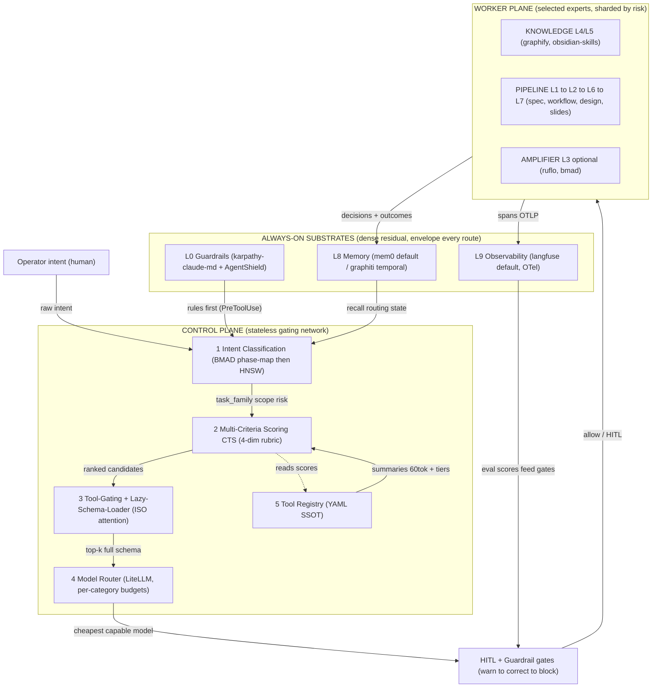
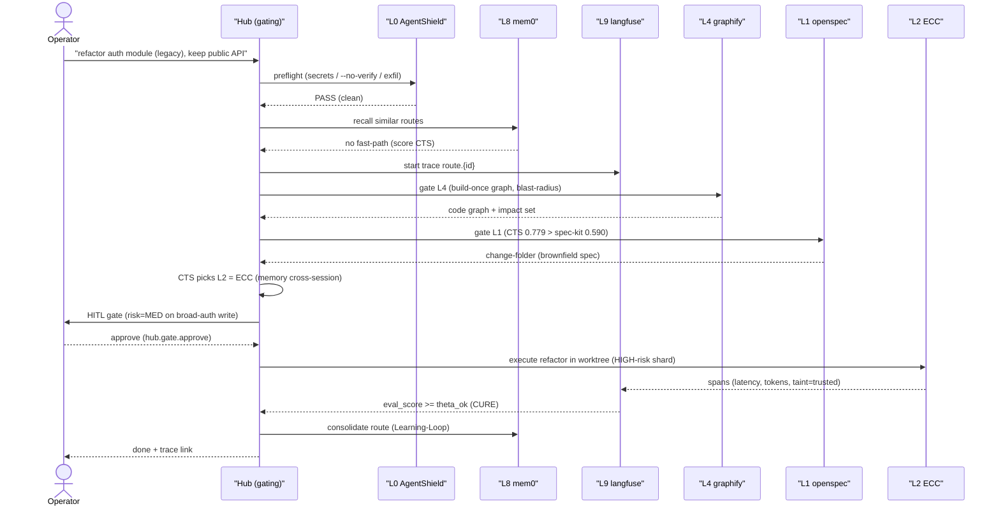

# Phase 3 — Orchestrator/Hub: the MoE Gating Network (middleware Agentic-Tool Orchestrator)

> **🔁 Reframe — MAOS Hub (ADR-006, Accepted 2026-06-29):** o hub **"ATH"** projetado nesta série foi
> ratificado e realizado como o **MAOS Hub** — a gating-network MoE **nativa** do MAOS (evolução do
> `maos-mcp-hub`, não um produto novo). **ATH ⊂ agentic-moe-2026 ⊂ MAOS.** Este arquivo é preservado
> como registro histórico datado (2026-06-27); status vivo do hands-on: `README.md` §"Status do hands-on".


> **Título:** Agentic MoE 2026 — desenho concreto do **HUB middleware** = a **gating network** Mixture-of-Experts que roteia um humano ⇄ expert(s) dinamicamente selecionados, montada **sobre** os substratos always-on (L0 guardrails + L8 memory + L9 observability).
> **Fase:** 3 — Orchestrator/Hub (DESENHO; sem nova pesquisa web — fundamentado em 00 + 02, reusando padrões de 01a/01c/01d).
> **Observado:** 2026-06-27 (estrelas/licenças = ordem-de-magnitude datada do RUN 0; identidades canonicalizadas no arquivo 00).
> **Nota de idioma:** prosa em **pt-BR**; identificadores, comandos, nomes de repositório, YAML, fórmulas e tags de mecanismo em **en-US**.
> **Depende de:** `20260627-00-canonicalization.md` (identidades/licenças/vereditos de segurança) + `20260627-02-ntree-moe.md` (o grafo de roteamento MoE em que este HUB se apoia). **Reusa padrões** de `20260627-01a-substrates.md` (defaults: mem0/graphiti/langfuse), `20260627-01c-pipeline.md` (ECC/NanoClaw O(1) gating + colisão de instrução L2 + AgentShield) e `20260627-01d-amplifier.md` (ruflo Queen→topology + Learning-Loop + behavioral-trust; BMAD persona→phase).
> **Princípio DRY:** LiteLLM (model gateway) e os MCP gateways são **primitivas de INFRA** — usadas, não reinventadas. O learning-loop, o trust-scoring e o O(1) routing são **importados** dos experts (não reimplementados).

---

## (a) ARQUITETURA EM CAMADAS — o pipeline de gating sobre os substratos

O HUB é um **plano de controle (control plane) stateless** que materializa o gating network simbólico-estratificado descrito no arquivo 02 §0. Diferente de um MoE neural (gating denso aprendido), aqui o gating é **simbólico + estratificado**: os substratos (L0·L8·L9) **envelopam** densamente toda rota (residual sempre somado), enquanto a pipeline (L1→L2→L6→L7) e o knowledge (L4·L5) recebem **top-1 esparso por slot**.

**Pipeline de 5 estágios** (cada estágio consome o anterior; substratos cross-cut todos):

1. **Intent Classification** — classifica o intent do operador em `{task_family, scope, methodology, risk_hint}`. Reusa o sinal de gating do **BMAD** (`fase_do_SDLC → persona`, 01d §4.2) como classificador simbólico barato de primeira linha; sobe para classificação semântica (embedding + lookup HNSW, padrão **ruflo**) só em alta ambiguidade.
2. **Multi-Criteria Scoring (CTS)** — pontua candidatos por **ISO × Eisenhower × risk × scope × methodology × reversibility** sob o rubric de 4 dimensões (Expert-fit / Authorization / Task-frame / Risk-frame). Detalhe em (c).
3. **Tool-Gating / Lazy-Schema-Loader** — atenção gateada sobre o **pool permanente de summaries** (≤60 tokens/tool); promove o schema completo só para os top-k tools gateados. Resolve o "MCP/Tools Tax". Detalhe em (b).
4. **Model Router (Switchcraft-style)** — escolhe o modelo capaz mais barato por tool-call via **LiteLLM** (INFRA) + budgets por categoria. Detalhe em (g).
5. **Tool Registry** — a fonte-de-verdade declarativa (YAML por tool) que alimenta os estágios 2–4. Detalhe em (d).



> **Validade Mermaid:** IDs alfanuméricos (`OP`,`S1`…`S5`,`L0/L8/L9`,`KN`,`PIPE`,`AMP`,`GATE`,`WP`); todos os labels entre aspas (parênteses e setas-texto escapados pelas aspas); subgraphs com `direction` explícito; setas para subgraph (`L9 --> GATE`, `S4 --> GATE`, `GATE --> WP`) são válidas. Aresta tracejada `S2 -.-> S5` = leitura de scores. **Mermaid: VÁLIDO.**

---

## (b) TOOL ATTENTION / ISO — atenção gateada sobre um pool permanente de summaries

### O problema: "MCP/Tools Tax" + context-fracture

Cada servidor MCP injeta o schema completo de **todas** as suas tools na janela a cada turno. O arquivo 01c documenta o sintoma no ECC: ~14 MCP servers + preâmbulo SessionStart de 8000 chars erodem a janela de **200k → ~70k tokens**. Em landscapes ricos (este HUB referencia 26 experts, e ECC sozinho expõe ~14 servers; ruflo expõe **314 MCP tools**), o "Tools Tax" custa **10k–60k tokens/turn** só em descrições não-usadas. Acima de **~70% de utilização** da janela, o modelo sofre *context-fracture*: instruções always-on competem, precedência fica imprevisível (o mesmo achado da colisão L2 superpowers↔gstack↔ECC).

### A solução: ISO (Information-Scent Optimization) — gated attention de 2 níveis

O HUB mantém um **pool permanente de summaries** — exatamente **um summary de ≤60 tokens por tool** (campo `summary` do registry, (d)). Esse pool é o **único** custo de contexto fixo. O schema completo (parâmetros, exemplos, JSONSchema) é **lazy-loaded** apenas para os top-k tools que passam o gate. Padrão idêntico ao **lazy-schema** do `ToolSearch`/progressive-disclosure e ao "skill hot-load" do **NanoClaw** (01c): a tool existe por *nome+scent* até ser *promovida* a schema completo.

Matematicamente é uma **atenção gateada** (sparse top-k softmax) sobre o pool de summaries:

```
# Para cada tool i no pool permanente (summary embeddings pré-computados):
score_iso(i)   = sim(q, summary_i)                 # cosine(query, summary≤60tok)
gate(i)        = 1  if  CTS(i) ≥ θ_layer  AND  hard_filters(i) = PASS   else 0
                 # CTS = score multi-critério de (c); hard_filters de (c)/(h)/(i)
weight(i)      = softmax_k( score_iso(i) · gate(i) )           # top-k mask
PROMOTE(i)     = weight(i) > 0                                  # carrega schema completo só destes
context_cost   = Σ_i len(summary_i)  +  Σ_{PROMOTE(i)} len(schema_i)
                 #   ~60·N (fixo, barato)   +   k·|schema| (variável, top-k apenas)
```

- **Nível 1 (sempre):** todos os N summaries ≤60tok no contexto → custo fixo ~`60·N` tokens.
- **Nível 2 (gateado):** só os `k` tools com `weight(i)>0` recebem schema completo. Tipicamente `k ∈ [3,7]` por slot de layer (top-1 esparso na pipeline, top-k no knowledge).

**Como isso mata o Tools Tax:** em vez de `Σ |schema_i|` (10k–60k tokens), paga-se `60·N + k·|schema|`. Para N=80 tools e k=5, isso é `~4.8k + ~5k ≈ 10k` no pior caso vs `>40k` sem gating — e mantém a utilização **abaixo de 70%**, evitando o context-fracture. O `θ_layer` é o threshold por camada (mais baixo para L0/L8/L9 que são densos/always-on; mais alto para L3 amplifier que é caro/opcional).

---

## (c) MULTI-CRITERIA SCORING (CTS) — ISO × Eisenhower × risk × scope × methodology × reversibility

O CTS combina **seis critérios** sob o **rubric de gating de 4 dimensões** (mapeamento explícito abaixo). **Hard filters primeiro** (eliminam candidatos antes de qualquer soma ponderada — economia + segurança), depois a função ponderada ordena os sobreviventes.

### Os 6 critérios → 4 dimensões do rubric

| Critério (sinal) | Dimensão do rubric | O que mede | Fonte do padrão |
|---|---|---|---|
| **ISO** `sim(q, summary)` | **Expert-fit** | quão bem o scent da tool casa o intent | (b); HNSW lookup do ruflo |
| **scope** (file/module/repo/org) | **Expert-fit** | o tool opera no escopo certo? | grafo 02 (Axis2 PURPOSE) |
| **methodology** (greenfield/brownfield/compliance) | **Task-frame** | a metodologia casa a tarefa? | BMAD phase-map (01d) |
| **Eisenhower** (urgent×important) | **Task-frame** | priorização da tarefa | quadrante clássico |
| **risk_tier** (LOW/MED/HIGH) | **Risk-frame** | dano potencial da ação | AgentShield tiers (01c) |
| **reversibility** (reversible/irreversible) | **Risk-frame** | dá para desfazer? | RUN 0 precedents (00) |
| **authorization** (read-only/scoped/broad) | **Authorization** | o tool tem permissão p/ isto? | ECC autorização (01c) |

### Hard filters (executam ANTES da soma — qualquer falha = candidato eliminado)

```
HF1  security_status ∈ {EXCLUDED, FLAGGED}                 -> REJECT  (ex.: GSD original, MemPalace)
HF2  license ∈ {none, NOASSERTION} AND context = "commercial-redistribution" -> REJECT (ex.: seed/base/karpathy)
HF3  authorization_required > authorization_granted         -> REJECT  (escala de privilégio)
HF4  layer_incompatible(candidate, already_selected)        -> REJECT  (ex.: spec-kit XOR openspec; base XOR ECC)
HF5  risk_tier = HIGH AND HITL_token ausente                -> HOLD    (vai p/ gate humano, não roteia)
HF6  reversibility = irreversible AND approval ausente       -> HOLD    (idem)
```

### Função de scoring ponderada (sobreviventes dos hard filters)

```
CTS(i) =  w_iso   · iso(i)                       # Expert-fit
        + w_scope · scope_match(i)               # Expert-fit
        + w_meth  · methodology_match(i)         # Task-frame
        + w_eis   · eisenhower(i)                # Task-frame
        - w_risk  · risk_penalty(i)              # Risk-frame  (PENALIDADE: subtrai)
        - w_rev   · irreversibility_penalty(i)   # Risk-frame  (PENALIDADE: subtrai)
        + w_trust · trust_score(i)               # Authorization (behavioral-trust importado)

# trust_score importado VERBATIM do ruflo (01d §4.5), reusado sem reimplementar:
trust_score(i) = 0.4·success_rate + 0.2·uptime + 0.2·threat_clearance + 0.2·integrity

# Pesos default (operador pode sobrescrever por contexto; soma dos positivos = 1.0):
w_iso=0.30  w_scope=0.15  w_meth=0.15  w_eis=0.10  w_trust=0.30   # positivos
w_risk=0.50 w_rev=0.40                                            # penalidades (escala maior: segurança domina)
```

### Worked example — intent: *"refatore o módulo de auth deste repo legado, sem quebrar a API pública"*

Classificação (estágio 1): `task_family=refactor`, `scope=module`, `methodology=brownfield`, `risk_hint=MED`, `reversibility=reversible` (worktree), `eisenhower=important_not_urgent`.

Candidatos L1 (spec): **openspec** vs **spec-kit** (mutuamente exclusivos, HF4 deixa passar só na ausência do outro).

| Sinal | openspec | spec-kit | nota |
|---|---:|---:|---|
| HF (filtros) | PASS | PASS | ambos MIT/clean |
| iso (Expert-fit) | 0.88 | 0.55 | "brownfield/iterativo" casa o intent |
| scope_match | 1.0 | 1.0 | ambos operam em module/repo |
| methodology_match | 1.0 | 0.4 | openspec é brownfield-first; spec-kit é greenfield/compliance |
| eisenhower | 0.6 | 0.6 | igual |
| risk_penalty | 0.2 | 0.2 | igual (escrita de spec, baixo) |
| irreversibility_penalty | 0.0 | 0.0 | reversível |
| trust_score | 0.85 | 0.85 | ambos maduros |

```
CTS(openspec) = 0.30·0.88 + 0.15·1.0 + 0.15·1.0 + 0.10·0.6 + 0.30·0.85 − 0.50·0.2 − 0.40·0.0
              = 0.264 + 0.15 + 0.15 + 0.06 + 0.255 − 0.10 − 0.0  = 0.779
CTS(spec-kit) = 0.30·0.55 + 0.15·1.0 + 0.15·0.4 + 0.10·0.6 + 0.30·0.85 − 0.50·0.2 − 0.40·0.0
              = 0.165 + 0.15 + 0.06 + 0.06 + 0.255 − 0.10 − 0.0  = 0.590
```

**Decisão:** `openspec` (0.779 > 0.590) vence o slot L1 — coerente com a receita "Refactor de legado" do arquivo 02 §4. O gating é **interpretável** (o delta vem inteiramente de `iso` + `methodology_match`, ou seja, "brownfield casa melhor").

---

## (d) TOOL REGISTRY SCHEMA — YAML por tool (SSOT do gating)

Cada tool é um nó do grafo 02 declarado como um registro YAML. Campos obrigatórios: `layer`, `role`, `summary` (≤60 tok — alimenta o pool ISO de (b)), `preconditions`, `risk_tier`, `authorization`, `harness_coverage`, `security_status`, `mechanisms[]`. Quatro exemplos preenchidos a partir dos dados **verificados** (00/01a/01c):

```yaml
# ---- L8 MEMORY (default) ----
- id: mem0
  repo: mem0ai/mem0
  layer: L8
  role: memory-substrate-default
  summary: "Universal pluggable memory layer; add/search User/Session/Agent state; tenant-isolated; reproducible benchmark; the always-on recall substrate."   # ~38 tok
  preconditions: ["substrate slot L8 empty OR mem0 already primary", "store reachable (lib/self-host/cloud)"]
  risk_tier: LOW
  authorization: read-write   # scoped to memory store, per-tenant
  harness_coverage: ["claude-code","codex","cursor","windsurf","opencode","openclaw"]
  security_status: INCLUDED   # Apache-2.0; clean
  mechanisms: ["MCP","memory","filesystem","git-repo","rules","TCP"]

# ---- L0 GUARDRAIL / SECURITY (ECC's AgentShield as the L0 scanner) ----
- id: ecc-agentshield
  repo: affaan-m/ECC          # AgentShield ships within ECC + standalone ecc-agentshield
  layer: L0
  role: supply-chain-security-scanner
  summary: "Static-analysis gate: 102 rules across secrets(14 patterns), permission audit, hook-injection, MCP risk, agent-config; grade A-F; exit2 blocks build."   # ~40 tok
  preconditions: ["runs in PreToolUse / CI before any write", "target = CLAUDE.md/settings/MCP/hooks/agents/skills"]
  risk_tier: LOW              # the scanner itself is read-only over config
  authorization: read-only
  harness_coverage: ["claude-code","codex","cursor","opencode","gemini","zed","copilot"]
  security_status: INCLUDED   # MIT; note ECC-vs-base/gstack incompatibility (HF4)
  mechanisms: ["rules","hooks","filesystem","git-repo"]

# ---- L6 GENERATIVE DESIGN (broad studio, security caveat) ----
- id: open-design
  repo: nexu-io/open-design
  layer: L6
  role: generative-design-studio
  summary: "Local-first multi-surface studio (web/mobile/deck/img/video); HTML/PDF/PPTX/MP4; BYOK 12 CLIs; broad but bypassPermissions default."   # ~36 tok
  preconditions: ["L2 produced a plan/spec to design from", "EXTRA sandbox+egress policy applied (bypassPermissions risk)"]
  risk_tier: HIGH             # bypassPermissions total -> needs HITL per (h)/(i)
  authorization: broad        # full filesystem; unsigned builds
  harness_coverage: ["claude-code","devin","hermes","kimi","kiro"]   # ACP
  security_status: INCLUDED   # Apache-2.0; flag: bypassPermissions (sandbox required)
  mechanisms: ["filesystem","git","memory","rules","hooks","ACP"]

# ---- L3 AMPLIFIER (optional meta-routing; requires L8+L9) ----
- id: ruflo
  repo: ruvnet/ruflo
  layer: L3
  role: swarm-runtime-meta-router
  summary: "Optional 2-level meta-router: Queen topology select then MoE+HNSW agent dispatch; 314 MCP tools; learning-loop; MUST provision L8+L9; overkill if solo."   # ~40 tok
  preconditions: ["high ambiguity OR real parallelization OR cross-session memory needed", "L8 (mem0/AgentDB) AND L9 (langfuse) provisioned"]
  risk_tier: MED              # broad orchestration surface; 27 hooks
  authorization: broad
  harness_coverage: ["claude-code","codex"]
  security_status: INCLUDED   # MIT; benchmarks self-reported [UNVERIFIED]
  mechanisms: ["MCP","filesystem","git-worktree","git-branch","memory","hooks","TCP"]
```

> O registry inteiro (26 INCLUDED + BRIDGE graphiti) é gerado a partir da N-Tree do 02 §1; só os 4 acima estão expandidos por brevidade. O campo `summary` é deliberadamente **≤60 tokens** porque é o que vai no pool permanente de (b).

---

## (e) MEMORY SUBSTRATE — como o HUB persiste/recorda estado e decisões de roteamento

O HUB é stateless **no plano de controle**, mas sua *memória de roteamento* (quais experts foram escolhidos, com que score, com que outcome) é persistente em L8. Modelo **tiered L0..Ln** (espelha o Multi-Level Memory do mem0 + o ReasoningBank do ruflo):

| Tier | Conteúdo | Backend default | TTL/escopo |
|---|---|---|---|
| **L0-mem** (working) | janela atual: candidatos, scores CTS, gate decisions | em-memória (efêmero) | turno |
| **L1-mem** (session) | trajetória de rotas da sessão; `{intent, chosen_expert, CTS, outcome}` | **mem0** (Session) | sessão |
| **L2-mem** (operator) | preferências do operador (pesos CTS sobrescritos, experts banidos) | **mem0** (User) | persistente |
| **L3-mem** (episodic) | ReasoningBank de rotas: `{task, input, output, reward[0-1], success, tokensUsed, latencyMs}` | **mem0** + opção **graphiti** | persistente, com decay |
| **Ln-mem** (temporal) | fatos de roteamento com janela de validade ("expert X regrediu desde release Y") | **graphiti** (bi-temporal, BRIDGE L4↔L8) | invalidação, não delete |

**Consolidação = reuso do Learning-Loop do ruflo (DRY, 01d §4.5)** — o HUB **não reimplementa**; consome via MCP o ciclo de 4 fases como primitivo de L8:

```
RETRIEVE  (top-k MMR sobre L3-mem: rotas passadas similares ao intent atual)
   → JUDGE      (LLM-as-judge pontua se a rota escolhida foi boa — alimenta L9 evals)
   → DISTILL    (extrai a regra: "para task_family=X em scope=Y, expert=Z venceu")
   → CONSOLIDATE(dedup + pruning; promove regra a fast-path de gating; aplica decay)
```

Resultado: rotas frequentes viram **fast-paths** (cache de gating) — na próxima vez que `task_family=refactor ∧ scope=module ∧ methodology=brownfield` aparecer, o HUB recupera "openspec venceu (0.779)" sem re-pontuar tudo. A **temporalidade graphiti** garante que, se um expert for rebaixado (ex.: novo CVE, regressão), o fato antigo é *invalidado* em vez de apagado — preservando auditoria.

---

## (f) OBSERVABILITY SUBSTRATE — todo route traçado OTel-native; evals alimentam os gates

Cada rota emite spans **OTLP** para **langfuse** (default, 01a §L9) — `LangfuseSpanProcessor` no `@opentelemetry/sdk-node`. Trace hierárquico por rota:

```
span: route.{trace_id}
 ├─ span: intent.classify        attrs={task_family, scope, methodology, risk}
 ├─ span: cts.score              attrs={candidates[], scores[], hard_filters_rejected[]}
 ├─ span: gate.tool              attrs={promoted_tools[], context_cost_tokens}
 ├─ span: model.route            attrs={model_chosen, category, budget_remaining}
 ├─ span: hitl.gate              attrs={verdict: allow|warn|block, approval_id?}
 └─ span: expert.exec.{layer}    attrs={tool_id, latency_ms, tokens, error?, output_taint}
```

**Eval scores → gates warn→correct→cure** (cadeia de remediação): o LLM-as-judge do langfuse (ou Opik se evals-as-gate forte) pontua cada rota; o score realimenta os gates de (h):

```
eval_score ≥ θ_ok        -> CURE   (rota validada; consolida no Learning-Loop como sucesso)
θ_warn ≤ score < θ_ok    -> WARN    (loga aviso; sugere correção; não bloqueia)
score < θ_warn           -> CORRECT (força replan: volta ao estágio 2 com penalidade no expert)
unsafe_call detectado    -> BLOCK   (curto-circuita; ver (i))
```

**Telemetria por camada:** cost/latency/error por `layer` e por `tool_id` (atributos do span). Isso fecha o loop com o Model Router de (g) — budgets por categoria são medidos aqui — e com a memória de (e) — `tokensUsed/latencyMs` do ReasoningBank vêm destes spans.

> ⚠️ **Caveat de licença (00/01a):** langfuse é **NOASSERTION** — MIT-core **exceto as pastas `ee/`** (Enterprise Edition, proprietárias). Se o requisito for OSS-puro, usar só o core MIT (sem `ee/`) ou trocar por **openllmetry + backend Apache** (opik). É o único default não-Apache-puro.

---

## (g) MODEL ROUTER (Switchcraft-style) — modelo capaz mais barato por tool-call via LiteLLM

O Model Router escolhe o **modelo mais barato que ainda é capaz** para cada tool-call, via **LiteLLM** como gateway (INFRA — NOASSERTION, "Phase 3 only" no 00; usado, não reinventado). Cada categoria de tool tem um budget e um tier mínimo de capacidade:

| Tool category | Min capability tier | Default model (cheapest capable) | Per-category budget hint |
|---|---|---|---|
| `classify/route` (estágio 1) | small | haiku-class / SLM local | very-low (alto volume) |
| `summary/scent` (pool ISO) | small | SLM local (embeddings) | minimal (pré-computado) |
| `spec/plan` (L1) | medium | sonnet-class | medium |
| `code/workflow` (L2) | high | sonnet/opus-class (TDD precisa rigor) | high |
| `design` (L6) | medium | sonnet-class (BYOK do studio) | medium |
| `judge/eval` (L9) | medium | sonnet-class (consistência de juiz) | low-medium |
| `amplifier` (L3) | high | opus-class + multi-provider (ruflo) | high (gated, opcional) |

Roteamento (sketch): `model = litellm.pick(category.min_tier, budget_remaining, latency_slo)`. Se o budget da categoria estourar, o router **rebaixa** (downgrade) o tier ou enfileira para HITL — fechando o loop com a telemetria de custo de (f). Multi-provider (Claude/GPT/Gemini/Ollama) é nativo do LiteLLM; o HUB só declara a política, não a mecânica.

---

## (h) GUARDRAIL & HITL GATES — warn → correct → block; L0 sempre primeiro

**L0 guardrails executam SEMPRE primeiro** (PreToolUse — antes de qualquer escrita), espelhando o ECC (rules always-on + PreToolUse hooks, 01c). A cadeia de severidade é progressiva:

```
WARN     -> aviso no trace + sugestão; a rota PROSSEGUE (ex.: tool fora do scope ideal)
CORRECT  -> força replan no estágio 2 com penalidade no expert (ex.: eval_score baixo de (f))
BLOCK    -> curto-circuita a rota; nada é executado (ex.: hard filter HF1/HF3 de (c), ou unsafe-call de (i))
```

**HITL obrigatório** (a rota fica em `HOLD`, não roteia, até aprovação humana) quando:
- `risk_tier = HIGH` (ex.: `open-design` com bypassPermissions; deploy de produção), **ou**
- `reversibility = irreversible` (HF6), **ou**
- escolha mutuamente-exclusiva de alto impacto (ex.: spec-kit vs openspec — a receita do 02 marca isso como gate humano).

**Mapa para o rubric de 4 dimensões** (qual dimensão dispara qual gate):

| Dimensão (rubric) | Gate disparado | Exemplo |
|---|---|---|
| **Authorization** | BLOCK (HF3) | tool pede privilégio > concedido |
| **Risk-frame** | HITL HOLD (HF5/HF6) | risk=HIGH ou irreversível |
| **Task-frame** | CORRECT | metodologia errada → replan |
| **Expert-fit** | WARN | scope/scent subótimo, mas seguro |

---

## (i) SECURITY MODEL — supply-chain, tainting, sandbox/egress, failover

Reusa **AgentShield** (ECC, 01c) como o scanner L0 de supply-chain (registry: `ecc-agentshield`), executado em **PreToolUse** e em CI (exit 2 gateia builds):

### Supply-chain scanning (PreToolUse style — bloqueia antes de executar)
```
- BLOCK  `git ... --no-verify`                  # burla hooks de segurança/pre-commit
- DETECT secrets por regex (14 patterns do AgentShield): `sk-…`, `ghp-…`, `AKIA…`  -> BLOCK + redact
- PREVENT exfiltração de CLAUDE.md/.claude/ via tool-output ou egress não-autorizado
- PROFILE risco de MCP server (hook-injection analysis + MCP risk profiling, 102 rules)
```

### Tool-output tainting (modelo de 3 estados)
Toda saída de tool carrega um rótulo de taint propagado pelo grafo de rotas:
```
trusted    — fonte interna verificada (filesystem do repo, mem0 do próprio tenant)
untrusted  — fonte externa (web fetch, repo de terceiro, output de sub-agente externo)
derived    — produto de mistura: derived = trusted ⊕ untrusted  (herda untrusted: pessimista)
```
`untrusted`/`derived` **não podem** alimentar um tool de `authorization=broad` sem passar por um gate de sanitização (regra: *taint não escala privilégio*). Isso é o análogo de roteamento do AIDefence/PII-pipeline do ruflo.

### Sandbox + egress por tool
Cada tool roda no seu **sandbox** com **egress policy** declarada (campo derivável do registry). Tools `risk_tier=HIGH`/`authorization=broad` (ex.: `open-design` bypassPermissions) exigem sandbox reforçado + egress allowlist. **Failover:** se um expert falhar/timeout, o HUB cai para o segundo-colocado do CTS (degradação graciosa), nunca para um expert `FLAGGED`.

### Amarração aos precedentes do RUN 0 (00 §0.1) — por que o gate é necessário
- **GSD rug-pull** (`$GSD` Solana, saque ~US$500K, npm abandonado): `security_status=EXCLUDED` via **HF1**; o sucessor seguro `open-gsd/gsd-core` é o único roteável. O HUB **nunca** roteia para o pacote original.
- **MemPalace** (star-manip + benchmark não-auditável): `EXCLUDED/FLAGGED` via HF1; `mem0` (benchmark reproduzível) é o default justamente por auditabilidade.
- **License=none** (karpathy/base/seed): **HF2** rejeita redistribuição comercial; mantidos como política de baseline com flag, nunca tratados como OSS-permissivo.

---

## (j) COMPOSITION RECIPES embutidas no roteamento (presets, substrate-first)

As **6 receitas** do arquivo 02 §4 viram **routing presets** — atalhos de gating que pré-selecionam o stack (sempre L0+L8+L9 primeiro). Cada preset é um conjunto de pesos CTS + experts pré-gateados:

| Preset (routing) | Stack (substrate-first → pipeline) | Gate / HITL embutido |
|---|---|---|
| `new-idea-mvp` | karpathy(L0)+mem0(L8)+langfuse(L9) → seed → spec-kit **\|** openspec(L1) → superpowers(L2) → open-codesign(L6) → frontend-slides(L7) | HITL na escolha spec-kit↔openspec (HF4) + aprovação do plano (clarify) |
| `legacy-refactor` | karpathy+base(L0)+cognee(L8)+langfuse(L9) → understand-anything(L4) → graphify(L4) → openspec(L1) → superpowers(L2) | HITL no code-review com severidade; cuidado p/ não commitar grafo com segredos |
| `enterprise-feature` | karpathy(L0)+graphiti(L8 temporal)+langfuse(L9 HIPAA) → graphify(L4) → spec-kit(L1 constitution) → gstack **\|** superpowers(L2) → open-design(L6) → slidev(L7) | HITL nos gates de compliance (/speckit.analyze, /cso); **não empilhar gstack+ECC** (HF4) |
| `prod-deploy` | base(L0 drift)+mem0(L8)+langfuse(L9 evals-gate) → gsd-core(L1 verify-before-ship) **\|** gstack(/ship) → impeccable(L6 linter CI) | HITL na aprovação do PR + canary; ⚠ gsd-core = SÓ o fork open-gsd (HF1) |
| `codebase-onboarding` | karpathy(L0)+cognee(L8)+langfuse(L9) → understand-anything(L4 tour) → graphify(L4 export) → obsidian-skills(L5 vault) | risco baixo (read-mostly); HITL opcional na revisão do domínio extraído |
| `long-session-memory` | karpathy(L0)+**letta** **\|** mem0+graphiti(L8)+langfuse(L9) → ECC **\|** gsd-core(L1/L2) → ruflo(L3 learning-loop, opcional) | ⚠ letta = lock-in de runtime; ruflo = overkill se solo (HF: skip amplifier) |

> `**\|**` = escolha mutuamente-exclusiva resolvida pelo CTS/HITL no momento da rota. Os presets são **defaults**, não trilhos: o operador pode sobrescrever pesos, e o Learning-Loop (e) ajusta os fast-paths com o uso real.

---

## (k) EVALUATION — métricas, plano de testes, deployment/scaling

### Métricas
| Métrica | Definição | Alvo |
|---|---|---|
| **routing precision** | rotas corretas / rotas escolhidas | ↑ (>0.9) |
| **routing recall** | experts certos ativados / experts que deveriam | ↑ |
| **task completion rate** | tarefas concluídas sem replan manual | ↑ |
| **unsafe-call rate** | tool-calls bloqueados por (i) / total | ↓ (→0) |
| **token cost / route** | `60·N + Σ schema promovido` + exec (de (f)) | ↓ vs baseline sem gating |
| **latency p50/p95 / route** | tempo do estágio 1 ao expert.exec | ↓ |
| **approval-fatigue** | nº de HITL holds / sessão | ↓ (gates calibrados, não ruidosos) |

### Plano de testes
- **6 task families** × **{low, med, high} risk** (matriz 6×3 = 18 células): `new-idea`, `refactor`, `enterprise-feature`, `deploy`, `onboarding`, `long-session` (espelham os presets de (j)).
- **A/B with vs without gating** — medir token cost e context-fracture (% acima de 70% de utilização) com e sem o ISO de (b).
- **Security injection tests** — payloads `--no-verify`, secrets `sk-/ghp-/AKIA`, tentativa de exfiltração de CLAUDE.md, MCP malicioso (deve disparar BLOCK/HF1); taint-escalation (untrusted→broad deve ser barrado).
- **Approval-fatigue calibration** — varrer thresholds `θ_warn/θ_ok` e contar HITL holds para achar o ponto onde segurança não vira ruído.

### Deployment / scaling
- **Control plane stateless** (estágios 1–5): escala horizontal trivial (sem estado entre requests; o estado vive em L8/L9). Réplicas atrás de um LB.
- **Worker pools shardados por risk_tier**: pool `LOW` (read-mostly, sem sandbox pesado, alta densidade), pool `MED`, pool `HIGH` (sandbox reforçado + egress allowlist + HITL obrigatório de (h)/(i)). Sharding por risco isola blast-radius e dimensiona custo por tier.
- **Substrates como serviços compartilhados**: mem0/graphiti/langfuse rodam como backends multi-tenant (já são, por design) — um por workspace/tenant, não por rota.

---

## (l) REFERENCE IMPLEMENTATION — MCP-server sketch + sequência de roteamento

### Tool names expostos pelo HUB (MCP server `maos-hub`)
`hub.route` (intent → rota), `hub.score` (debug CTS), `hub.registry.get` (lê YAML), `hub.gate.approve` (HITL token), `hub.trace` (link langfuse da rota).

### Loop de gating dirigido pelo registry (~40 linhas, ilustrativo)
```python
# maos-hub: registry-driven gating loop (illustrative — LiteLLM + MCP gateways are INFRA, used not reimplemented)
def hub_route(intent: str, ctx: Context) -> Route:
    # ESTÁGIO 0 — substratos always-on (dense residual)
    guardrails_preflight(ctx)                       # L0: AgentShield PreToolUse (block --no-verify, secrets, exfil)
    prior = mem0.recall(intent, ctx.tenant)         # L8: fast-path lookup (Learning-Loop consolidated rule?)
    span = langfuse.start_span("route", intent=intent)   # L9: OTel trace begins

    if prior and prior.confidence > FASTPATH_THETA: # consolidated fast-path hit -> skip full scoring
        return finalize(prior.route, span)

    # ESTÁGIO 1 — intent classification (BMAD phase-map cheap; HNSW only if ambiguous)
    frame = classify(intent)                        # {task_family, scope, methodology, risk, reversibility, eisenhower}

    # ESTÁGIO 2 — CTS: hard filters FIRST, then weighted score
    pool = registry.load()                          # YAML SSOT (d); summaries already ≤60 tok in context
    survivors = [t for t in pool if hard_filters(t, frame, ctx) == "PASS"]   # HF1..HF6 (c)
    holds     = [t for t in pool if hard_filters(t, frame, ctx) == "HOLD"]   # risk=HIGH / irreversible -> HITL
    scored    = sorted(survivors, key=lambda t: cts(t, frame, ctx), reverse=True)  # (c) weighted fn

    # ESTÁGIO 3 — tool-gating + lazy schema (ISO attention (b)): promote only top-k
    gated = topk_by_layer(scored, k_per_layer=K)    # top-1 pipeline slot, top-k knowledge
    for t in gated: t.schema = registry.load_full_schema(t.id)   # lazy promote (NanoClaw hot-load)

    # ESTÁGIO 4 — model router (cheapest capable via LiteLLM, per-category budget (g))
    for t in gated: t.model = litellm.pick(t.category.min_tier, ctx.budget, ctx.slo)

    # GATE — warn/correct/block + HITL (h); taint check (i)
    verdict = gate(gated, holds, span)              # BLOCK/HF -> raise; HOLD -> await hub.gate.approve
    if verdict.needs_hitl: return await_hitl(holds, span)

    # EXEC — selected experts (sharded worker pool by risk); spans + outcomes back to L8/L9
    route = execute(gated, ctx, span)               # worker plane
    langfuse.judge(route, span)                     # L9 eval -> warn/correct/cure (f)
    mem0.consolidate(intent, route, span.outcome)   # L8 Learning-Loop: RETRIEVE→JUDGE→DISTILL→CONSOLIDATE (e)
    return finalize(route, span)
```

### Routing SEQUENCE — brownfield refactor (graphify → openspec → ECC com HITL gate)


> **Validade Mermaid:** `sequenceDiagram` com `actor` + `participant ... as "label"` (aliases alfanuméricos `Hub`,`L0`,`L8`,`L9`,`Gfy`,`Osp`,`ECC`); mensagens com `->>` (sync) e `-->>` (return); labels e textos de mensagem livres de caracteres que quebrem o parser. **Mermaid: VÁLIDO.**

---

## (m) PRAGMATISM FILTER — alternativas over-engineered REJEITADAS (explícito)

O HUB é deliberadamente **simbólico-estratificado e barato**, não um sistema distribuído especulativo. Rejeitado, com motivo:

| Rejeitado | Por quê (não roteável / não construído) |
|---|---|
| **Blockchain audit trail** | A proveniência temporal do **graphiti** (bi-temporal, invalidação) já é trilha de auditoria nativa; blockchain adiciona custo/latência sem ganho. O precedente $GSD (00) é exatamente o *anti-padrão* de "crypto em dev-tooling". |
| **Quantum / quantum-routing** | Zero base no landscape; o gating é top-k softmax sobre embeddings — clássico, O(N) no pool. Nenhuma tarefa exige. |
| **Self-replicating agent swarms** | ruflo (L3) já cobre swarm **gateado e opcional**; auto-replicação sem bound é justamente o que os gates HF5/HF6 + HITL existem para impedir. Over-kill documentado (01d §5.2). |
| **Distributed design sem use-case real** | Control plane stateless + worker pools shardados (k) cobrem o scaling real. "Distribuído" só onde há tenant multi-máquina — a federação do ruflo é opcional, não default. |
| **"L10 gateway layer"** | Os MCP gateways e o LiteLLM são **INFRA** (00 marca litellm "Phase 3 only / infra-primitive), não uma camada de experts. Promovê-los a "L10" inventaria uma camada que o grafo 02 não tem — viola DRY e a estratificação canônica (L0–L9). |
| **Gating neural denso aprendido** | O arquivo 02 §0 é explícito: este gating é **simbólico + estratificado**, não MoE neural. Treinar um roteador denso é custo sem retorno quando BMAD-phase + ISO + CTS já são interpretáveis e auditáveis. |

---

*Phase 3 · Orchestrator/Hub · MoE gating network sobre substratos always-on (L0·L8·L9) · observado 2026-06-27. Prosa pt-BR, identificadores/YAML/fórmulas en-US. Depende de 00 + 02; reusa padrões de 01a/01c/01d. Infra (LiteLLM + MCP gateways) usada, não reinventada. [UNVERIFIED] herdados do upstream: dígitos exatos de estrelas (ECC/superpowers/etc. via [sec]); benchmarks self-reported do ruflo ("89% routing accuracy", AgentDB speedup); webhooks do ruflo; string SPDX exata de phoenix. [UNVERIFIED] desta fase (extrapolação de design): valores numéricos default dos pesos CTS, thresholds θ_layer/θ_warn/θ_ok e a contagem de tokens do pool ISO são propostas de engenharia a calibrar empiricamente no plano de testes (k), não medições.*
