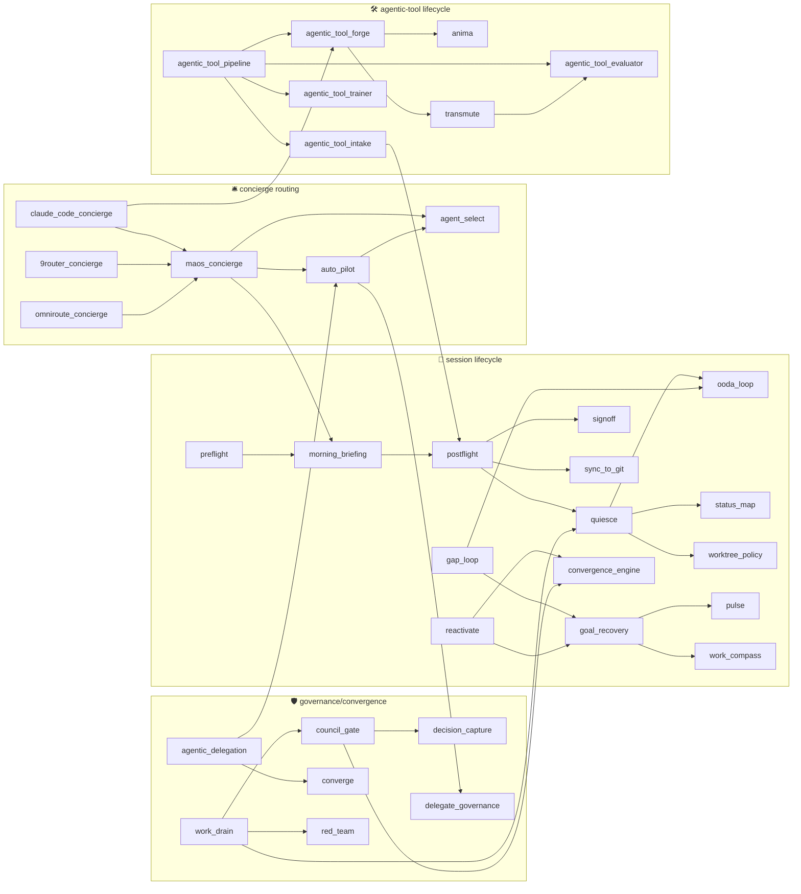

# Agent Skills

## Overview

This folder contains reusable Agent Skills for the Multi-Agent OS framework. Skills follow the [Agent Skills open standard](https://agentskills.io) (SKILL.md format) and are compatible with 30+ AI tools including Claude Code, Cursor, Codex, Gemini CLI, Kiro, VS Code, GitHub Copilot, Goose, and others.

> **Inventory refresh 2026-08-25**: table below is generated from each skill's frontmatter `description` (86 skills). Dependency graph covers the session/agentic-tool/governance core families (edges extracted from `maos:` refs, `[[wikilinks]]`, `skills/` path refs in SKILL.md bodies).

## Available Skills (86)

| Skill | Directory | Description |
|-------|-----------|-------------|
| `9router-concierge` | `9router-concierge/SKILL.md` | Concierge / health-check / inventory / router for the operator's **9Router** gateway (local OpenAI-compatible AI gateway). |
| `agent-select` | `agent-select/SKILL.md` | Analyze tasks and recommend optimal sub-agent(s) for execution |
| `agentic-delegation` | `agentic-delegation/SKILL.md` | Use when about to spawn a subagent/skill/task (Task tool, Agent tool, /command). |
| `agentic-session-harness` | `agentic-session-harness/SKILL.md` | Generic, vendor-neutral session-observability engine (ASH — Agentic Session Harness). |
| `agentic-tool-evaluator` | `agentic-tool-evaluator/SKILL.md` | Use when you need to evaluate, test, score, benchmark, or QA an agentic-tool (a skill/SKILL.md, agent, subagent, slash-command, prompt, or MCP-tool) — |
| `agentic-tool-forge` | `agentic-tool-forge/SKILL.md` | Use when you want to turn a raw intent/instruction into a REUSABLE agentic-tool — e.g. |
| `agentic-tool-intake` | `agentic-tool-intake/SKILL.md` | Use when you have a CANDIDATE tool that already exists (an external repo/MCP/plugin/skill someone found, e.g. |
| `agentic-tool-pipeline` | `agentic-tool-pipeline/SKILL.md` | Conductor of the agentic-tool lifecycle — given ANY --source-object (intent · url · plugin · marketplace · path to an existing tool), ROUTE it to the  |
| `agentic-tool-trainer` | `agentic-tool-trainer/SKILL.md` | Use when you want to improve, tune, coach, or evolve an existing agentic-tool (skill/agent/subagent/command/prompt/MCP-tool) based on its eval results |
| `anima` | `anima/SKILL.md` | Generate ONE precise name/identifier for anything (files, modules, DBs, agentic-tools, brands, media, prompts). |
| `anti-conflict` | `anti-conflict/SKILL.md` | Prevent file conflicts between multiple AI agents working in parallel |
| `atomize-and-route` | `atomize-and-route/SKILL.md` | Given ANY content (braindump · prompt · doc · transcript · insight · gap · pendency · idea · template) decompose it into TYPED knowledge atoms (norm · |
| `audit` | `audit/SKILL.md` | On-demand audit and analysis of agent orchestration flows via Sentinel Protocol |
| `auto-pilot` | `auto-pilot/SKILL.md` | Autonomous unattended orchestration entry point. |
| `bitbucket-pipeline-watch` | `bitbucket-pipeline-watch/SKILL.md` | Use when an agent needs to WAIT for a Bitbucket Cloud pipeline/build to finish and act on the outcome — instead of fixed-interval polling. |
| `bot-finding-arbiter` | `bot-finding-arbiter/SKILL.md` | Soul-name **Praetor**. |
| `chief-of-staff` | `chief-of-staff/SKILL.md` | Operator-facing work-focus conductor — the human twin of the agent-facing reactivate/Entelecheia. |
| `claude-code-concierge` | `claude-code-concierge/SKILL.md` | Concierge / onboarding / router / docs-researcher / guarded-operator for the CLAUDE-CODE PLATFORM ITSELF — installing, configuring, using the CLI, man |
| `content-recast` | `content-recast/SKILL.md` | Use when you need to RE-TARGET a piece of your own technical content for a DIFFERENT audience, abstraction level, intent, or language — then optionall |
| `context-prep` | `context-prep/SKILL.md` | Prepare optimal context package before delegating tasks to sub-agents |
| `converge` | `converge/SKILL.md` | Converge ≥2 AI-agent proposals into one validated synthesis via a 5-act protocol (steelman → critique → compare → synthesize → reject-log). |
| `convergence-engine` | `convergence-engine/SKILL.md` | Iterative multi-agent quality-convergence engine: a deterministic harness that bounds and verifies probabilistic cognition to lift a result toward (bu |
| `corpus-firing-audit` | `corpus-firing-audit/SKILL.md` | Use to audit whether a governance corpus is ALIVE or THEATER — does each rule/memory/instruction actually FIRE at a live decision point, or is it pres |
| `council-gate` | `council-gate/SKILL.md` | Pre-HITL democratic council-authorization gate (soul-name Boule). |
| `decision-capture` | `decision-capture/SKILL.md` | Capture a non-trivial agent decision (with sources + rationale + spec-alignment) into the ASH decision-audit trail via `agentic-decide`, so it can lat |
| `decompose-abstract-to-measurable` | `decompose-abstract-to-measurable/SKILL.md` | Use when a task, DoR, DoD, metric, KPI, or acceptance criterion is ABSTRACT ("is this good / healthy / professional / beautiful / stylish / risky / in |
| `delegate-governance` | `delegate-governance/SKILL.md` | Emit the correct governance prompt (init / dna / finalize) before, during, and after delegating to a sub-agent. |
| `deliberate-coding` | `deliberate-coding/SKILL.md` | MAOS-native deliberation-before-coding guardrail principles (L0 substrate, content-not-runtime). |
| `derive-system-from-goal` | `derive-system-from-goal/SKILL.md` | Given a goal, derive the MINIMAL RECURRING SYSTEM (the vehicle) that conducts to it — BEFORE pursuing it. |
| `directive-braindump-triage` | `directive-braindump-triage/SKILL.md` | Use to triage an operator directive-braindump (a scratch of mixed directives, e.g. |
| `dogfood-ledger` | `dogfood-ledger/SKILL.md` | Count real dogfood cycles per agentic-tool (the ≥2-cycle promotion gate authority). |
| `eisenhower-matrix` | `eisenhower-matrix/SKILL.md` | List unresolved pendencies for --scope=[current\|session\|repo\|vault\|all] ordered by Eisenhower matrix (Q1 urgent+important → Q4). |
| `enhance-pipeline` | `enhance-pipeline/SKILL.md` | Drive ONE feature/enhancement through the full divergent→convergent→deliver lifecycle: EXPAND (analyze · internal+external research · find gaps/fails/ |
| `find-docs` | `find-docs/SKILL.md` | Retrieves and queries up-to-date documentation and code examples from Context7 for any programming library or framework. |
| `founder-playbook` | `founder-playbook/SKILL.md` | Diagnose where an AI-native startup is in its lifecycle (Idea → MVP → Launch → Scale) and route to the right stage discipline. |
| `founder-stage-idea` | `founder-stage-idea/SKILL.md` | Idea-stage discipline for an AI-native startup: validate that a real, specific, frequent problem exists — and that your solution addresses it — BEFORE |
| `founder-stage-launch` | `founder-stage-launch/SKILL.md` | Launch-stage discipline for an AI-native startup: turn early traction into a repeatable, channel-driven growth engine and build the company around the |
| `founder-stage-mvp` | `founder-stage-mvp/SKILL.md` | MVP-stage discipline for an AI-native startup: turn a validated problem into the smallest focused product that real users actually use, while moving f |
| `founder-stage-scale` | `founder-stage-scale/SKILL.md` | Scale-stage discipline for an AI-native startup: build systematic, mature-org growth and a defensible moat while keeping the lean AI-centered structur |
| `gap-loop` | `gap-loop/SKILL.md` | Harness-agnostic, self-driven, self-scored condition-loop that drives a GAP-REGISTER (G1..Gn) to convergence — loops until [every gap dispositioned (f |
| `goal-recovery` | `goal-recovery/SKILL.md` | Recover a work session's real INTENT from its own live/context state — motivations, DoR, context, scope, and the objective tree {originating, primary, |
| `hierarchical-merge` | `hierarchical-merge/SKILL.md` | Enforce hierarchical merge protocol - branches merge to parent, not directly to main |
| `ichnos` | `ichnos/SKILL.md` | Use to apply Google-Analytics-style usage analytics to our OWN agentic-tools corpus — attribution (how was a skill actually reached: a direct /command |
| `lens-dispatch` | `lens-dispatch/SKILL.md` | Deterministic dispatcher of cognitive lens-stacks per work-graph node. |
| `maos-concierge` | `maos-concierge/SKILL.md` | Concierge / onboarding / guide / router / capability-detector / governance-anchor for the ENTIRE Multi-Agent OS (MAOS) framework — its agents, skills, |
| `memory-gateway` | `memory-gateway/SKILL.md` | Use when creating, updating, superseding, archiving, reading, searching, or walking the persistent memory corpus. |
| `morning-briefing` | `morning-briefing/SKILL.md` | Deterministic SitRep briefing of operator work state (repos/PRs/tasks/memory) for fast context restore. |
| `mvv-synthesis` | `mvv-synthesis/SKILL.md` | Synthesize Mission, Vision, Values from ontological analysis output |
| `notebooklm` | `notebooklm/SKILL.md` | Route NotebookLM work between the notebooklm-py CLI, the notebooklm-mcp-cli MCP server, and the `@notebooklm-mcp` Claude Code toggle. |
| `omniroute-concierge` | `omniroute-concierge/SKILL.md` | Concierge / health-check / inventory / router for the operator's **OmniRoute** gateway (v3.8+ local AI proxy). |
| `ontological-analysis` | `ontological-analysis/SKILL.md` | Analyze repository through 8 philosophical dimensions for MVV extraction |
| `ooda-loop` | `ooda-loop/SKILL.md` | Run a profile-aware, bounded delivery loop when work arrives through chat, ticket, backlog, specification, PR, hook, webhook, bootstrap or prototype. |
| `opendesign-concierge` | `opendesign-concierge/SKILL.md` | Concierge / onboarding / guide / capability-detector for the Open Design platform (`nexu-io/open-design` — the open-source, agent-native, local-first  |
| `opera-debrief` | `opera-debrief/SKILL.md` | Use when you want to deliver a session/work recap as a FAITHFUL, dosed NARRATIVE — a "summary as an opera": a short story-arc (acts) with measured hum |
| `operator-quote-capture` | `operator-quote-capture/SKILL.md` | Use when operator says "salva isto", "tome nota", "remember this", "from now on", "capture this rule/tip", OR when detecting substantive operator quot |
| `pii-masking` | `pii-masking/SKILL.md` | Synchronous CI-time PII detection — CPF Modulo-11 (algorithmic checksum, not just regex), RFC 5322 email subset (catastrophic-backtracking-safe), E.16 |
| `postflight` | `postflight/SKILL.md` | Use at the END of a session/action — especially before the operator compacts or clears the conversation — to close the workspace out cleanly and hand  |
| `praxis-audit` | `praxis-audit/SKILL.md` | Self-referential session-method audit — turn the firing/theater lens onto THIS session's OWN enacted methods/tools (not the standing governance corpus |
| `preflight` | `preflight/SKILL.md` | Use at the start of a session or before starting an action/task in any git repo to get the workspace into a correct, healthy, isolated, ticket-anchore |
| `proofread` | `proofread/SKILL.md` | Use when FINALIZING any text artifact — a doc / ADR / README / ticket body / PR description / commit message / release note — to check GRAMMAR (pt-BR  |
| `pulse` | `pulse/SKILL.md` | Session re-orientation skill. |
| `quiesce` | `quiesce/SKILL.md` | Drive the current work session to QUIESCENCE — a steady state with no pending work: no open ticket/gap/fix/failure/PR, every PR green, every PR commen |
| `reactivate` | `reactivate/SKILL.md` | Cold-start reactivation conductor for new-fresh-born amnesic agents. |
| `red-team` | `red-team/SKILL.md` | Decide WHEN an adversarial red-team is MANDATORY for an action, and HOW deep — then route to the right existing primitive (build nothing new). |
| `refine-braindump-to-prompt` | `refine-braindump-to-prompt/SKILL.md` | Lapidate ONE raw operator braindump into ONE polished, ready-to-execute PROMPT. |
| `repo-custody-transfer` | `repo-custody-transfer/SKILL.md` | Transfer CUSTODY of a repository between git hosts (Bitbucket Cloud → GitHub first-class; soul-name Translatio) as a reversible, resumable, idempotent |
| `research-dossier` | `research-dossier/SKILL.md` | Turn finished research into a decision-ready visual dossier — html, md, json, and hand-offs to pdf/pptx/xlsx — routed through an intermediate represen |
| `response-compression` | `response-compression/SKILL.md` | Controls output verbosity. |
| `reveng` | `reveng/SKILL.md` | Use to REVERSE-ENGINEER source code into an OpenSpec SPEC model (the as-built behavioral contract) — e.g. |
| `rule-quality-tests` | `rule-quality-tests/SKILL.md` | Use when creating new rules, modifying existing rules at MAJOR/MINOR version bump, OR when operator says "audit this rule" / "check rule quality" / "v |
| `session-fission` | `session-fission/SKILL.md` | On-demand splitter for a tangled Claude session. |
| `session-reentry` | `session-reentry/SKILL.md` | Cold/foreign-thread RE-ENTRY orchestrator (soul-name Anamnesis). |
| `signoff` | `signoff/SKILL.md` | The operator's END-OF-SESSION SIGN-OFF (encerramento) verb — invoked when you are DONE and want the session closed out AND its pending work left disco |
| `skill-writer` | `skill-writer/SKILL.md` | Creates and maintains Agent Skills following the open standard (compatible with 30+ AI tools). |
| `slm-routing` | `slm-routing/SKILL.md` | Declarative decision rubric for routing AI work between a small local language model (SLM) and a remote frontier LLM. |
| `status-map` | `status-map/SKILL.md` | Generate human-readable ASCII status visualizations for agent sessions |
| `sync-to-git` | `sync-to-git/SKILL.md` | Git synchronization automation for AI agents with GitHub/Bitbucket support |
| `system-health-responder` | `system-health-responder/SKILL.md` | End-of-action reflex that reads the system-health contract, engage-locks, Eisenhower-ranks the warnings, does MODERATE non-destructive auto-heal (auto |
| `transcript-corrector` | `transcript-corrector/SKILL.md` | Use when you have a transcribed text (meeting transcript, voice-note transcript, call transcript, dictation) that may contain ASR (automatic-speech-re |
| `transmute` | `transmute/SKILL.md` | Transmute ONE source of ANY kind (text · prompt · draft · braindump · doc · code · agentic-tool · email · report) through a menu of transformations (c |
| `ttl-policy` | `ttl-policy/SKILL.md` | Manage Time-To-Live policies for framework content freshness |
| `voice-director` | `voice-director/SKILL.md` | Use when the operator EXPLICITLY asks to SPEAK/narrate something aloud — "fala isso", "narra o resumo", "speak this", "voz de aplauso", "--media audio |
| `walkthrough-concierge` | `walkthrough-concierge/SKILL.md` | Concierge / onboarding / guide / router / governance-anchor for the ASH-lite Agentic Session Harness — session journals, the walkthrough (decisions +  |
| `work-compass` | `work-compass/SKILL.md` | Aggregate the operator's scattered work — Jira/GitHub issues, Claude + cross-vendor (Codex) sessions, git worktrees/branches/stashes/uncommitted-WIP,  |
| `work-drain` | `work-drain/SKILL.md` | Given one or more <object-targets> (a sprint, a backlog query, open PRs, tracker issues, a filter), DISCOVER every matching item across trackers, DERI |
| `worktree-policy` | `worktree-policy/SKILL.md` | Enforce mandatory git worktree usage for multi-agent file modifications |

## Skill families (by name-cluster)

- **Agentic-tool lifecycle**: `agentic-tool-forge` (genesis) · `agentic-tool-intake` (adopt-or-not) · `agentic-tool-evaluator` (score/QA) · `agentic-tool-trainer` (improve/distill) · `agentic-tool-pipeline` (conductor)
- **Session lifecycle**: `preflight` → `morning-briefing` → `postflight` (+ `quiesce` · `signoff` · `sync-to-git` · `session-fission` · `session-reentry` · `reactivate` · `context-prep`)
- **Concierge routing**: `maos-concierge` · `claude-code-concierge` · `9router-concierge` · `omniroute-concierge` · `opendesign-concierge` · `walkthrough-concierge`
- **Governance & convergence**: `council-gate` · `convergence-engine` · `converge` · `red-team` · `delegate-governance` · `worktree-policy` · `anti-conflict` · `hierarchical-merge` · `ttl-policy` · `pii-masking`
- **Loops & recovery**: `ooda-loop` · `gap-loop` · `goal-recovery` · `auto-pilot`
- **Founder journey**: `founder-playbook` · `founder-stage-idea` · `founder-stage-mvp` · `founder-stage-launch` · `founder-stage-scale`

## Inter-dependency graph (core families)

## Skill Categories (curated highlights)

### Delegation Skills
- `agent-select` — Agent selection algorithm
- `agentic-delegation` — Pre-spawn briefing + accountability preservation

### Observability Skills (Sentinel Protocol)
- `audit` — On-demand session/agent/task auditing
- `status-map` — ASCII status visualizations
- `system-health-responder` — Health-check responses
