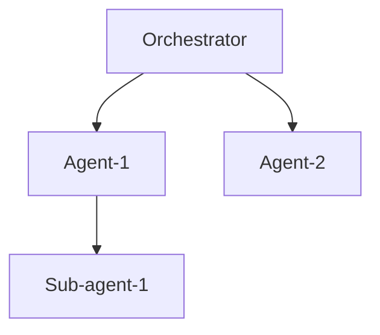
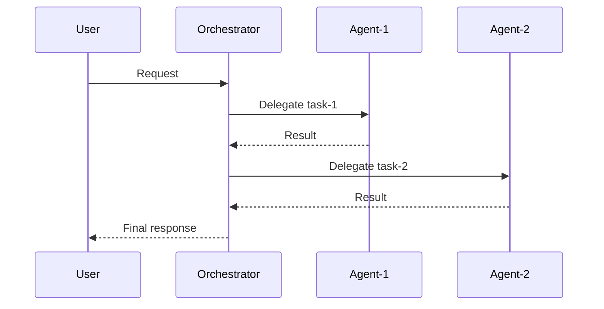
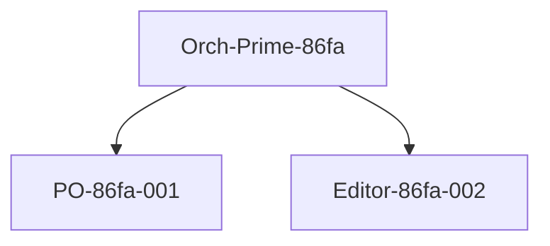

# Audit Skill

## Purpose

Provides on-demand analysis of agent orchestration flows. While Sentinel's automatic hooks handle continuous monitoring, this skill enables deep analysis when explicitly requested.

## When to Use

- After completing a complex multi-agent workflow
- When anomalies were detected and need investigation
- Before presenting results to stakeholders (quality check)
- When debugging unexpected agent behavior
- Periodic session health reviews

## Invocation Syntax

```
/audit <scope> [options]
```

### Scopes

| Scope | Description | Example |
|-------|-------------|---------|
| `session` | Full audit of current session | `/audit session` |
| `agent <id>` | Audit specific agent | `/audit agent Claude-PO-86fa-001` |
| `task <id>` | Audit specific task | `/audit task task-001` |
| `flow` | Delegation flow visualization | `/audit flow` |
| `anomalies` | List all detected anomalies | `/audit anomalies` |
| `health` | Calculate health score | `/audit health` |

### Options

| Option | Description | Example |
|--------|-------------|---------|
| `--verbose` | Include full trace details | `/audit session --verbose` |
| `--export` | Export to markdown file | `/audit session --export` |
| `--since <timestamp>` | Filter by time | `/audit anomalies --since 2026-01-06T19:00` |
| `--severity <level>` | Filter by severity | `/audit anomalies --severity HIGH` |

### New Commands (v1.1.0)

| Command | Description | Example |
|---------|-------------|---------|
| `/audit config` | Show current configuration | `/audit config` |
| `/audit validate` | Validate trace against schema | `/audit validate` |
| `/audit compliance` | Check hook compliance | `/audit compliance` |
| `/audit index` | Show session index | `/audit index` |
| `/audit rebuild-index` | Rebuild session index | `/audit rebuild-index` |

## Execution Steps

### Step 1: Load Audit Log

```
Read .claude/audit/session_{current_session}.jsonl
Parse JSONL entries into structured data
```

### Step 2: Apply Scope Filter

```
IF scope == "session":
    data = all_entries
ELIF scope == "agent":
    data = filter(entries, agent_id == target)
ELIF scope == "task":
    data = filter(entries, task_id == target)
ELIF scope == "flow":
    data = extract_delegation_chain(entries)
ELIF scope == "anomalies":
    data = filter(entries, has_anomaly == true)
ELIF scope == "health":
    data = calculate_health_score(entries)
```

### Step 3: Analyze Data

```
FOR each entry in data:
    - Parse trace metadata
    - Extract metrics
    - Identify patterns
    - Calculate aggregates
```

### Step 4: Generate Report

```
Compose structured markdown report
Include visualizations where applicable
Add recommendations based on findings
```

## Output Format

### Session Audit (`/audit session`)

```markdown
## Audit Report — Session {session_id}

### Session Summary
| Metric | Value |
|--------|-------|
| Session ID | {session_id} |
| Started | {start_time} |
| Duration | {duration} |
| Agents spawned | {agent_count} |
| Tasks executed | {task_count} |
| Delegations | {delegation_count} |
| Anomalies | {anomaly_count} |
| Health Score | {health_score}/100 |

### Agent Activity

| Agent | Tasks | Success | Errors | Avg Duration |
|-------|-------|---------|--------|--------------|
| {agent_id} | {count} | {success}% | {errors} | {avg_ms}ms |

### Delegation Chain



### Anomaly Summary

| Time | Agent | Rule | Severity | Description |
|------|-------|------|----------|-------------|
| {ts} | {agent} | {rule} | {severity} | {description} |

### Recommendations

1. {recommendation_1}
2. {recommendation_2}

### Health Score Breakdown

| Component | Score | Notes |
|-----------|-------|-------|
| Loop-free | +{n} | {status} |
| Depth compliant | +{n} | {status} |
| Error-free | -{n} | {status} |
| Performance | +{n} | {status} |
| **Total** | **{total}** | |
```

### Agent Audit (`/audit agent <id>`)

```markdown
## Agent Audit — {agent_id}

### Agent Profile
| Field | Value |
|-------|-------|
| Agent ID | {agent_id} |
| Type | {agent_type} |
| Parent | {parent_id} |
| Created | {created_at} |
| Status | {status} |

### Task History

| Task ID | Description | Duration | Result |
|---------|-------------|----------|--------|
| {id} | {desc} | {ms}ms | {success/fail} |

### Metrics
- **Total tasks**: {count}
- **Success rate**: {rate}%
- **Avg duration**: {ms}ms
- **Total tokens**: {tokens}

### Anomalies (if any)
{anomaly_list}

### Chain Context
```
Parent: {parent}
  └─ This Agent: {self}
       └─ Children: {children}
```
```

### Flow Audit (`/audit flow`)

```markdown
## Delegation Flow Analysis

### Visual Flow



### Flow Statistics
- **Total delegations**: {count}
- **Max depth**: {depth}
- **Parallel branches**: {branches}
- **Consolidations**: {consolidations}

### Dependency Graph
{mermaid_dependency_graph}

### Critical Path
{step_1} → {step_2} → {step_3}
```

### Anomalies Audit (`/audit anomalies`)

```markdown
## Anomaly Report — Session {session_id}

### Summary
- **Total anomalies**: {count}
- **HIGH severity**: {high_count}
- **MEDIUM severity**: {medium_count}
- **LOW severity**: {low_count}

### Anomaly Log

#### 🔴 HIGH Severity

| # | Time | Agent | Rule | Description | Action Taken |
|---|------|-------|------|-------------|--------------|
| 1 | {ts} | {agent} | RULE-001 | Loop detected | Blocked |

#### 🟡 MEDIUM Severity

| # | Time | Agent | Rule | Description | Action Taken |
|---|------|-------|------|-------------|--------------|
| 2 | {ts} | {agent} | RULE-003 | Task drift | Logged |

#### 🟢 LOW Severity

| # | Time | Agent | Rule | Description | Action Taken |
|---|------|-------|------|-------------|--------------|
| 3 | {ts} | {agent} | RULE-006 | Agent mismatch | Suggested |

### Pattern Analysis

{identified_patterns}

### Recommendations

1. {recommendation_1}
2. {recommendation_2}
```

### Health Audit (`/audit health`)

```markdown
## Health Score — Session {session_id}

### Overall Score

```
┌────────────────────────────────────────────────────────────┐
│                                                            │
│   HEALTH SCORE: {score}/100                               │
│                                                            │
│   ████████████████████░░░░░░░░░░  {score}%               │
│                                                            │
│   Status: {EXCELLENT|GOOD|FAIR|POOR}                      │
│                                                            │
└────────────────────────────────────────────────────────────┘
```

### Score Breakdown

| Factor | Impact | Notes |
|--------|--------|-------|
| Base score | 100 | Starting point |
| Loop-free delegations | +{n} | {count} clean delegations |
| Depth compliance | +0 | All within limit |
| No error cascades | +0 | No consecutive errors |
| Stagnation incidents | -{n} | {count} slow executions |
| Agent mismatches | -{n} | {count} suboptimal selections |
| **Final Score** | **{total}** | |

### Interpretation

{interpretation_text}

### Trend (if multiple sessions)

```
Session 1: ████████░░ 80/100
Session 2: █████████░ 92/100
Session 3: ███████░░░ 75/100 (current)
```
```

## Example Usage

### Example 1: Full Session Audit

**Input**:
```
/audit session
```

**Output**:
```markdown
## Audit Report — Session Claude-Orch-Prime-20260106-86fa

### Session Summary
| Metric | Value |
|--------|-------|
| Session ID | Claude-Orch-Prime-20260106-86fa |
| Started | 2026-01-06T19:00:00-03:00 |
| Duration | 1h 15m |
| Agents spawned | 3 |
| Tasks executed | 2 |
| Delegations | 2 |
| Anomalies | 0 |
| Health Score | 98/100 |

### Agent Activity

| Agent | Tasks | Success | Errors | Avg Duration |
|-------|-------|---------|--------|--------------|
| Claude-Orch-Prime-20260106-86fa | 2 | 100% | 0 | N/A |
| Claude-PO-86fa-001 | 1 | 100% | 0 | 45s |
| Claude-Editor-86fa-002 | 1 | 100% | 0 | 30s |

### Delegation Chain



### Anomaly Summary

No anomalies detected.

### Recommendations

1. Session executed optimally. Consider this as a reference pattern.
2. Both delegations completed successfully with clean handoffs.

### Health Score: 98/100 — EXCELLENT
```

### Example 2: Anomaly Investigation

**Input**:
```
/audit anomalies --severity HIGH
```

**Output**:
```markdown
## Anomaly Report — HIGH Severity Only

### Summary
- **HIGH severity anomalies**: 1

### Anomaly Log

| # | Time | Agent | Rule | Description | Action Taken |
|---|------|-------|------|-------------|--------------|
| 1 | 2026-01-06T19:30:00 | Claude-Dev-86fa-003 | RULE-001 | Loop detected: same task delegated twice | Blocked |

### Root Cause Analysis

The Dev agent attempted to re-delegate a code review task that it had already received. This created a potential infinite loop.

**Chain at detection**:
```
Orch → Dev → Dev (BLOCKED)
```

### Recommendations

1. Review task decomposition for Dev agent
2. Consider adding explicit "no-delegate" constraint for simple tasks
3. Verify Dev agent's context preparation includes anti-loop metadata
```

## Integration

This skill integrates with:
- **Sentinel Protocol**: Reads from audit log generated by trace hooks
- **Orchestrator**: Can be invoked at any point in session
- **Detection Rules**: References rule definitions for anomaly classification

### File References (v1.1.0)

| File | Purpose |
|------|---------|
| `.claude/sentinel/config.json` | Configuration settings |
| `.claude/sentinel/schema/trace_schema.json` | Trace validation schema |
| `.claude/sentinel/schema/alert_schema.json` | Alert format schema |
| `.claude/sentinel/lib/trace_writer.md` | Persistence patterns |
| `.claude/sentinel/lib/alert_handler.md` | Alert patterns |
| `.claude/audit/session_index.json` | Session lookup index |

### Config Audit (`/audit config`)

```markdown
## Current Sentinel Configuration

### Detection Thresholds
| Parameter | Value | Default |
|-----------|-------|---------|
| loop.similarity_threshold | 0.85 | 0.85 |
| depth.max_delegation_depth | 3 | 3 |
| drift.relevance_threshold | 0.50 | 0.50 |
| stagnation.timeout_ms | 300000 | 300000 |

### Enforcement Mode
Current: `soft` (log violations, allow continuation)

### Alert Channels
- in_conversation: enabled
- slack: disabled
```

### Compliance Audit (`/audit compliance`)

```markdown
## Hook Compliance Report — Session {session_id}

### Compliance Score: {score}%

### Hook Coverage
| Hook | Expected | Actual | Coverage |
|------|----------|--------|----------|
| PRE_DELEGATE | 10 | 10 | 100% |
| POST_DELEGATE | 10 | 9 | 90% |
| ON_ERROR | 2 | 2 | 100% |

### Missing Traces
| Time | Expected Hook | Agent | Notes |
|------|---------------|-------|-------|
| 21:30:45 | POST_DELEGATE | Dev-001 | No return trace found |

### Recommendations
1. Ensure all delegations have matching return traces
```

## Limitations

- Requires audit log to exist (hooks must have executed)
- Historical analysis limited to current session by default
- Cross-session analysis requires explicit `--since` option

---

## Changelog

### v1.1.0 (2026-01-06)
- Added `/audit config` command
- Added `/audit validate` command
- Added `/audit compliance` command
- Added `/audit index` command
- Added `/audit rebuild-index` command
- Updated file references for v1.0 infrastructure
- Added integration with trace_schema.json validation

### v1.0.0 (2026-01-06)
- Initial release

---

*Audit Skill v1.1.0 | Part of Sentinel Protocol | Claude-Orch-Prime-20260106-86fa*
