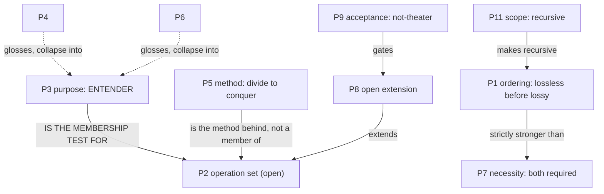

# Dogfood #2 — the pipeline run on the claim that specifies it

The first dogfood ran the skill on the braindump that motivated it. This one runs it on the
**operator's thesis about the pipeline itself** — the recursion clause fired at its sharpest.

Five prior passes were spent *comparing* versions of the thesis. That is not the pipeline; that is
talking about it. This run emits what the pipeline **requires**: a catalogue, a relation map, a
drop-list with reasons, a prism, and a decision.

---

## DISSECT — type every part

| # | Part | Type |
|---|---|---|
| P1 | "antes de decidir/lapidar/destilar" | **ordering claim** |
| P2 | "dissecar/prismar/separar/categorizar/identificar/tipar/catalogar/inter-relacionar/inter-conectar/**etc**" | **operation set** (explicitly open) |
| P3 | "para poder entender" | **purpose of P2** |
| P4 | "'abrir' para poder entender o conteúdo" | gloss of P3 (metaphor: open) |
| P5 | "dividir para conquistar" | **method** |
| P6 | "olhar dentro para entender com clareza" | gloss of P3 (metaphor: look inside) |
| P7 | "ambos são necessários" | **necessity claim** |
| P8 | "inclusive outros ismos que **podem** ser necessários" | **open extension** (conditional) |
| P9 | "para o sucesso real **não theater**" | **acceptance criterion** |
| P10 | "de nosso objetivo e propósito" | scope: this work |
| P11 | "…dos agentic-tools que estamos gerando irão gerar e operar" | **scope: recursive** |
| P12 | "sim ou não?" | verdict request |
| P13 | "valide, analise, critique, meta-critique, conclua, justifique, ooda" | method request |

## RELATE — the map



**Three edges carry everything, and none of them is a node:**

1. **`P3 → P2` is the decisive one.** The purpose is not a justification appended to the list — it is
   the list's **membership test**. An operation belongs iff its goal is *understanding*. So `/etc` is
   not vagueness; it is the **explicitly open set**, and P3 says how to decide entry.
2. **`P1 ⊃ P7`.** Ordering is *strictly stronger* than necessity. "Both are needed" permits any order;
   "before" does not. Answering only P7 — which every prior pass did — under-answers the claim.
3. **`P9 gates P8`.** "More ismos" is not an invitation to enumerate. It is bounded by not-theater.

## PRISM — make "entender" measurable

The membership test is abstract. Decomposed to checkable leaves:

> An operation belongs to the lossless movement **iff**
> **(a)** it discards nothing *(D — does it remove anything? binary)*
> **(b)** after it, you can answer a question you could not before *(T — name the question)*
> **(c)** it can halt on "I cannot do this to this input", **or** it emits an artifact *(D)*

Applied to the operator's own set:

| Operation | (a) lossless | (b) unlocks the question | (c) | Verdict |
|---|---|---|---|---|
| dissecar | ✅ | "what parts?" | halts | **member** |
| identificar / tipar | ✅ | "what IS this part?" | halts | **member** (one survives — near-synonyms) |
| inter-relacionar / inter-conectar | ✅ | "what depends on what?" | halts | **member** (one survives) |
| prismar | ✅ | "what is measurable here?" | halts (`inconclusive`) | **member** |
| catalogar / categorizar | ✅ | "what was in there?" | **emits** | **member — artifact, not gate** |
| **separar** | ⚠️ **ambiguous** | — | — | **sense-dependent, see below** |

**The predicate caught a straddler.** `separar` has two senses: *distinguish* (lossless → member) and
*set aside* (lossy → belongs with distill). The same Portuguese verb sits on both sides of the hard
boundary. A list could never have surfaced that; only the test could.

## DISTILL — drop-list with reasons

| Dropped | Reason |
|---|---|
| P13 (valide/analise/critique/…) | session-meta — governs the *answer's form*, not the claim |
| P12 ("sim ou não?") | verdict request, not content |
| P4, P6 | glosses of P3 — collapse into it. ⚠️ Their **triplication is signal**: P3 stated three ways is the load-bearing claim, not noise |
| `tipar`, `inter-conectar`, `categorizar` | near-synonyms / subsumed — one survives per concept |

## DECIDE — the lossy act, stated as such

Kept `identificar` over `tipar` (broader), `inter-relacionar` over `inter-conectar` (relation ⊃
connection), `catalogar` over `categorizar` (categorizing is *how* you catalogue). **These choices
kill alternatives and are not re-derivable from the artifact** — which is exactly what makes this
step lossy and why it comes after, never before, the map above.

## RENDER — the lapidated thesis

```text
Before any LOSSY operation — decide · distill · shape — run every LOSSLESS
operation that increases legibility, and EMIT what it produces.

MEMBERSHIP (the list is an instance; this is the definition)
  An operation belongs to the lossless movement iff:
    (a) it discards nothing;
    (b) after it you can answer a question you could not before;
    (c) it can halt on "I cannot do this to this input", or it emits an artifact.
  Known members: dissect · identify · relate · prism · catalogue.
  "etc" is the open set. Extend by the test, never by taste.
  Beware straddlers: "separate" is a member in the sense DISTINGUISH,
  and belongs to the lossy side in the sense SET ASIDE.

METHOD      divide to conquer.
ORDERING    strictly stronger than "both are necessary" — the order is the claim.
ACCEPTANCE  not-theater: every added operation must pass (a)(b)(c).
SCOPE       recursive — binds the tools we generate exactly as it binds us.
```

## Verdict

**The best version is not any of the six.** It is the one produced by running the pipeline on them:
the previous five passes each argued about *which enumeration* was right, and the enumeration was
never the claim. `P3 → P2` was an **edge** — invisible to five rounds of comparing node-lists, and
recoverable in one pass of RELATE.

That is the same shape as dogfood #1, where the decisive insight was also an edge. Twice now, on
different inputs: **comparing catalogues finds nodes; only the map finds what matters.**
