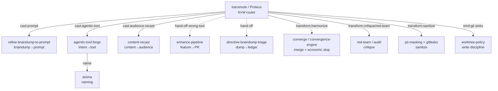

# Transmute

> **Soul-name**: *Proteus* — display only. The system-name `transmute` is the canonical
> slug, the `/command` trigger, and the `--json.name`. Greek *Prōteus* (Πρωτεύς), the Old
> Man of the Sea who assumes any form and, only when held fast, gives the true answer —
> the shape-shifter that yields truth under discipline. L. *transmutare*: change of form
> and essence. Alchemical lineage with the house (*Alambique* the still → *Lapidary* the
> stonecutter → *Proteus* the shapeshifter). Named via the `anima` engine discipline
> (verb-noun house pattern: `converge`, `quiesce`, `audit`); runner-up `omnicast`
> rejected (prefix inflation, less precise).

Thin **source→transform→cast→emit** router. It does not re-implement comprehension,
critique, convergence, type-routing, rendering, or sink discipline — it routes ONE
source through them. Every stage lands on a primitive that already exists in this repo
(or a user-scope sibling, invoked only if installed).

## Purpose

Generalize the fixed-pair siblings into ONE parameterizable matrix. Each sibling is a
**locked pair** (braindump→prompt, intent→tool, content→audience, feature→PR).
`transmute` is the **N×M** engine: any source × any transform-menu × any cast-target ×
any sink — by ROUTING to the sibling that owns each pair, never duplicating it.

```text
source:[any] × transform:[menu] × cast:[type] × emit:[sink]
```

## When to use

- The source is NOT a braindump/intent/content — or the target is NOT a prompt/tool/PR —
  so no fixed sibling fits the pair.
- The operator wants MULTIPLE casts of one source (e.g. prompt + skill + one-pager).
- The target LOCATION is a first-class requirement (vault · clipboard · git-repo · path).

## When NOT to use (terminal hand-offs)

Each wrong-tool case ends the run `STOP-DONE` + `skipped.handed_to` (one shape for
every non-entry, per `refine-braindump-to-prompt`'s convention):

| The ask really is… | Hand to |
|---|---|
| "braindump → ONE executable prompt" | `refine-braindump-to-prompt` |
| "recurring intent → reusable tool" | `agentic-tool-forge` |
| "re-target content for an audience" | `content-recast` |
| "braindump → durable VAULT artifacts (PARA placement)" | `braindump-distill` (eko-engram *Alambique* — vault-side SSOT; routing per `persist-locus`) |
| "what in this dump is already done?" | `directive-braindump-triage` |
| "ship this feature end-to-end (PR)" | `enhance-pipeline` |
| "improve an EXISTING tool" | `agentic-tool-trainer` |

**Single-sentence ask, single obvious output → just do it inline.** Destructive ops,
secrets, prod-irreversible → always `STOP-HITL`.

## §0 — BEING > Rules

If any gate obstructs delivering value NOW, skip it, log `Skipped <phase> — BEING >
Rules`, proceed. HUMAN_DOMAIN (secrets · PII · irreversibles · cross-org · cost) →
escalate, never auto-act. **The gitleaks/PII gate before emission is non-negotiable.**

## The pipeline predicate

```text
INTAKE    := resolve <source> (path | inline | pipe | glob) and TYPE it
            (text · prompt · draft · braindump · doc · code · agentic-tool · report)
            + resolve params; detect unfilled template placeholder (e.g. "{{BRAINDUMP}}"
              verbatim) -> STOP-ERROR naming the placeholder (do not transmute the wrapper)
COMPREHEND := lossless movement ONLY (dissect · type · relate · catalogue · prism DoD)
            — predicate + hard/soft boundary SSOT: refine-braindump-to-prompt §COMPREHEND
            (cite, never restate). Required outputs: parts catalogue + relation map.
TRANSFORM := apply --transforms menu, in canonical order:
            sanitize-first (stop-bleeding) -> analyze -> critique -> meta-critique
            -> red-team -> validate -> fix/solve -> enhance/expand -> refine/polish
            -> converge/harmonize. Each verb lands on its primitive (§Composition).
            Bounded by the economic stop (n*, per convergence-engine); NEVER unbounded.
CAST      := resolve target type (--to-type | default same-as-source, dynamic)
            and route to the OWNING sibling (§Cast router). Naming a cast artifact
            -> delegate to `anima` (register-hinted). Never re-implement type routing.
EMIT      := gitleaks+PII gate ONCE, unconditionally, before ANY sink
            -> per-sink render (idempotency declared per kind) -> best-effort with
            named per-kind status. Sink membership test (reachable · render-defined ·
            can-refuse) SSOT: refine-braindump-to-prompt §Output targets + persist-locus.
```

A phase is COMPLETE when its primitive returns a structured artifact the next phase
consumes. DONE when EMIT reports (or, under `--dry-run`, when the plan is emitted).

## Cast router (target-type → owning primitive)

| `--to-type` | Route to | Notes |
|---|---|---|
| `same-as-source` *(default)* | inline TRANSFORM output | source type from INTAKE; no re-cast; **dynamic calculated** per `--output-target` |
| `prompt` | `refine-braindump-to-prompt` (source=braindump → Lapidary) · `agents/prompt-context-engineer` + profile (else) | the prompt-craft seat; enhanced-prompt + gauntlet-prompt via profile `gauntlet-loop` |
| `agentic-tool:{skill\|command\|agent\|subagent\|rule\|memory\|hook\|webhook\|event\|trigger\|mcp\|plugin\|marketplace}` | `agentic-tool-forge` | type-decision router SSOT is the forge's; naming → `anima`; worktree→branch→PR per `[C04]`; marketplace needs `[C12]` provenance |
| `audience-recast` | `content-recast` | faithfulness guard lives there |
| `artifact:{md\|html\|pdf\|slides\|diagram\|confluence\|gamma\|canva}` | renderers (`document-generate` · `archify` · `make-pdf` · Gamma MCP · Canva fallback · atlassian-concierge) | never re-implement a renderer; `confluence` via atlassian MCP, `gamma`/`canva` via slides renderer |
| `ledger` | `directive-braindump-triage` | provenance ledger |
| `vault-artifact` | `braindump-distill` (eko-engram *Alambique*, user-scope IF vault mounted) | vault-side standing protocol — PARA placement + ledger + `persist-locus` routing; transmute routes there, never reimplements placement |
| `ticket` / `ticket:{jira\|linear}` | `ticket-as-prompt` (user-scope, IF installed) + `atlassian-concierge` / `vek-issue-router` | Jira/Linear render; `jira` = Atlassian, `linear` = Linear; backlog-ticket kind |

> **PT-verb mapping (operator dump → canonical TRANSFORM):** `analisado→analyze` · `dissecado/destrinchado→COMPREHEND dissect·catalogue·relate` · `investigado→analyze+research` · `criticado→critique` · `meta-criticado→meta-critique` · `validado→validate` · `revisto→critique+validate` · `corrigido→fix/solve` · `enhanced/improved/expanded→enhance/expand` · `refinado/lapidado→refine/polish` · `sanitizado→sanitize` · `harmonizado→converge/harmonize` · `compliance→validate+sanitize` (LGPD/GDPR/secure-by-design).

The router EMITS invocations (anti-NIH); a missing optional primitive degrades to the
in-repo column with a one-line diagnostic, never a hard failure.

## Composition (transform-verb → primitive)

| Verb family | In-repo primitive (ALWAYS) | Optional (IF installed) |
|---|---|---|
| analyze · find-gaps | `Grep`/`Glob`/`Read` + `Task` analysis | `pre-decision-audit` |
| critique · review | `skills/audit` · `skills/code-review` | `compounding-engineering:*` |
| meta-critique · council | `Task` fan-out lenses · `skills/council-gate` (HUMAN_DOMAIN only) | `claude-council` |
| red-team | `skills/red-team` | `red-teaming-mandatory-trigger` rule |
| validate | `skills/rule-quality-tests` (rules) · `skills/agentic-tool-evaluator` (tools) · test-runner (code) | — |
| fix · solve | root-cause-first + `skills/debug-like-expert` discipline | cascade-resolver (≤6 diverse attempts) |
| enhance · expand | EXPAND movement per `enhance-pipeline` §stage-1 | `find-docs` · WebSearch |
| refine · polish | `skills/convergence-engine` (economic stop) | `agents/perspective-trio` |
| harmonize · converge | `skills/converge` (5-act, AUDIT-not-PERSUASION) | `debate-converge` |
| sanitize | `skills/pii-masking` + gitleaks gate | 1Password `op` for secret extraction |
| dogfood | `skills/dogfood-ledger` | `agentic-tool-trainer` |

## Parameters

| Flag | Default | Notes |
|---|---|---|
| `<source>` (positional) | *required* | path · glob · inline text · `email` · `braindump` · `-` (stdin pipe). Empty or unfilled placeholder → `STOP-ERROR` |
| `--transforms` | `analyze,refine` | ordered comma list from the verb families above; `auto` = infer from source+target. PT verbs auto-mapped (see §Cast router). |
| `--to-type` | `same-as-source` | see §Cast router; `same-as-source` = **dynamic calculated** (type preserved); explicit `prompt`/`artifact:*/`/`agentic-tool:*`/`ticket` overrides |
| `--output-target` | *(none = report inline)* | comma sinks `stdout[,]{clipboard\|vault[:path]\|obsidian[:path]\|path:P\|git-repo:P\|agentic-tool:kind:path\|jira[:key]\|linear[:key]\|confluence[:space]\|gamma[:deck]\|canva[:design]\|bitbucket:P\|github:P\|atlassian:P}` — membership test per §EMIT (REACHABLE·RENDER DEFINED·CAN REFUSE). `obsidian` is alias of `vault`; `git-repo` covers `iketrans`/`vek-ai-toolkit`/`akasha` per `persist-locus` gate |
| `--mode` | `dry-run` | `dry-run` (report+plan only) · `run` (execute writes) · `dogfood` (run, then validate-on-self + ledger). Aliases `--dry-run`/`--run`/`--dogfood` accepted |
| `--principles` | `auto` | inherit host governance corpus BY REFERENCE (worktree · PDCA · S-SDLC · DRY/KISS/YAGNI · anti-over-eng · anti-theater · secure/privacy-by-design · LGPD/GDPR · boy-scout …) — never inline the corpus. `auto` = full corpus; `list` = csv subset validated against corpus (e.g. `GIT-WORKTREES-MANDATORY,IDEMPOTENT,SSOT,DRY`); unknown token → `STOP-ERROR` with valid list |
| `--user-lang` | `pt-BR` | operator-facing prose (`pt-BR` default) |
| `--agentic-lang` | `en-US` | language of the rendered artifact (`en-US` default, json-rpc payload) |
| `--agentic-format` | `json-rpc` | alias of `--output=json-rpc` (per `[C06]` notification shape `method`+`params`, no `id`); `table`/`json` also valid |
| `--output` | `table` | `table` \| `json` \| `json-rpc` (notification shape per `[C06]`). `--agentic-format` is alias |
| `--max-rounds` | `12` | hard cap for any looped verb → `STOP-HITL` on exhaustion |

`--dry-run`/`--run`/`--dogfood` are accepted as aliases of `--mode`. Dynamic runtime
params requested by a delegated primitive are computed and passed through (never
invented: an unfilled mandatory param → `STOP-HITL` with ranked resolution-paths).

## Output contract (`--output=json`)

```jsonc
{ "skill": "transmute",
  "phase": "INTAKE|COMPREHEND|TRANSFORM|CAST|EMIT|done",
  "status": "ok|error|hitl",
  "stop_marker": "STOP-DONE|STOP-HITL|STOP-ERROR|CONTINUE",
  "source": { "kind": "", "path": null },
  "transforms_applied": [],
  "cast": { "to_type": "", "routed_to": "", "artifact": null },
  "emission": { "targets": [ { "kind": "", "status": "emitted|failed|refused", "reason": null } ] },
  "skipped": { "condition": null, "handed_to": null } }
```

Exit codes: `0` emitted or plan (`dry-run`) · `1` error · `2` HITL.

## STOP-marker grammar (shared, not re-authored)

Exactly ONE terminal marker per turn — the `/goal` Stop-hook contract:
`STOP-DONE` · `STOP-HITL` · `STOP-ERROR` · `CONTINUE`.

## Failure modes

- **Empty / unreadable source** → `STOP-ERROR` before COMPREHEND.
- **Unfilled template placeholder detected** (e.g. `{{BRAINDUMP}}` verbatim) →
  `STOP-ERROR` naming the placeholder — the wrapper is an invocation, not a source.
- **No verb survives `auto` inference** (nothing meaningful to transform) →
  `STOP-DONE` + `skipped.condition: nothing-to-transmute`.
- **Cast target unknown / no owning primitive reachable** → `STOP-ERROR` listing valid
  `--to-type` values.
- **Sink refusal** (unreachable · render undefined · unauthorized) → `STOP-ERROR` with
  `refused.kind` + `refused.criterion`, BEFORE any emission.
- **Leak gate hit** → `STOP-ERROR` + `leak.rule`; aborts EVERY sink of the run.
- **Looped verb exhausts `--max-rounds`** → `STOP-HITL` (diminishing returns).
- **Delegated sibling halts** (e.g. forge gate REJECT, RECOVER halt) → carry its marker
  + payload up verbatim; never mask a child's `STOP-HITL`.

## Protocol Rules

- **Safe default**: `--mode=dry-run`; writes only under `--mode=run|dogfood`. `--dry-run` emits plan as `json-rpc` when `--agentic-format=json-rpc`.
- **Principles by-reference**: `--principles` never inlines the corpus; unknown principle → `STOP-ERROR` listing valid 40+ principals (GIT-WORKTREES-MANDATORY, GIT-PR-SUBMIT, IDEMPOTENT, SSOT, DRY, CLEAN-CODE, ANTI-OVER-ENG, ANTI-THEATER, LGPD-COMPLIANCE, etc). Dynamic runtime params beyond this list are computed per delegated primitive, never invented.
- **Worktree discipline always on** for any `git-repo`/`agentic-tool` sink
  (`skills/worktree-policy`); never commit to main. `iketrans`/`vek-ai-toolkit`/`akasha` are `git-repo:` kinds, same gate.
- **Delegation depth ≤ 2; parallel fan-out ≤ 3**; DNA-geracional transcribed to every
  delegate ("delegar não isenta a responsabilidade recebida").
- **Sanitize-first on dirty sources** (stop-bleeding-before-root-cause); gitleaks+PII
  gate is unconditional pre-emit.
- **Idempotent**: re-run on same source+params ⇒ same report; write-sinks skip-if-identical.
- External research time-boxed and cited; never fabricate prior art.
- HUMAN_DOMAIN + non-negotiable guardrails ALWAYS halt → HITL.

## Relationship to siblings (the inter-dependency map)



`transmute` and `enhance-pipeline` are duals: enhance-pipeline drives ONE feature to a
**shipped PR**; transmute drives ONE source to **cast artifacts at sinks** (no delivery
guarantee). If the operator's bar is "merged", route to enhance-pipeline.

## §Quality Tests (self-dogfood — 6/6)

1. **Self-Application** — forged via the forge pipeline (research→verdict→type→name→gate);
   its own `--dry-run` self-run produced the placeholder-detection failure mode. ✅
2. **Non-Contradiction** — routes to siblings, restates none; lossless-predicate and
   sink-test explicitly cite their SSOTs. ✅
3. **Survival** — applied to itself it prescribes a thin routing skill; it IS one. ✅
4. **Bounded-Responsibility** — safe default dry-run · hand-off table · depth ≤2 ·
   `--max-rounds` · DUED. ✅
5. **Explicit-Exception** — §0 BEING>Rules · HUMAN_DOMAIN carve-outs · `--to-type`
   force · unconditional leak gate (the one non-negotiable). ✅
6. **Utility-Sunset** — §DUED below. ✅

## §DUED Sunset (qualitative)

Deprecate when ANY: the host gains a native universal transmute surface (E1) · the
sibling matrix collapses into one lifecycle engine absorbing this router (E6) · operator
retraction (E4) · ≥3 consecutive runs that only ever hand off to ONE sibling (E5 — the
router added no routing). Dormant-by-design otherwise.

## Related

- `commands/transmute.md` — operator-facing command surface
- All §Cast-router and §Composition primitives (SSOTs cited in-table)
- Governance: `[C04]` worktree · `pr-review-protocol` · `[C06]` structured output ·
  `language-policy-en-pt`

## Versioning

- v0.2.0 — **generic enhance matrix (round n+9 /n+10)**: source×transform×cast×emit fully parametrizable per operator `/enhance` spec. **Cast router**: `agentic-tool:*` extended to `subagent/rule/memory/hook/webhook/event/trigger/mcp/plugin/marketplace`; `artifact:*` adds `confluence/gamma/canva`; `ticket` now `ticket:{jira|linear}`; `obsidian` alias of `vault`. **Sink axis**: `--output-target` adds `obsidian`, `jira`, `linear`, `confluence`, `gamma`, `canva`, `bitbucket`, `github`, `atlassian` (all mapped through `vault`/`git-repo`/`atlassian-concierge`/`ticket-as-prompt` renderers). **PT-verb mapping** table. **`--principles` validation** (csv against 40+ governance corpus; by-reference). **`--agentic-format=json-rpc`** alias + `--dry-run/--run/--dogfood` aliases documented. **COMPREHEND**: source kinds now include `email`·`folder`·`braindump`. **Prisma**: output/format/target as first-class `--to-type`+`--output-target` test (REACHABLE·RENDER DEFINED·CAN REFUSE). Dogfood targets: `braindump-distill.*`, `prompt-gauntlet-loop`, `prompt-transkriptor-import`, `theca/_inbox/2026-08-*.braindump.md` → `prompt`/`gauntlet-prompt`/`agentic-tool` at `obsidian/akasha/maos/vek-ai-toolkit/iketrans`. No new rival skill — extends Proteus per forge ≥50% gate.
- v0.1.3 — **cross-harness SSOT consolidation** (round n+5 recon): recon of the
  eko-engram ledger revealed the vault family (2026-08-14) reached the OPPOSITE
  verdict on the same directive-class ("dropped: new generic enhancer skill —
  compose-not-fork") — resolved as different denominators (vault: mint-in-
  ~/.agents? NO · repo: N×M-router gap? YES). Division ratified (extends the N2
  split): WHERE=persist-locus · HOW=Lapidary `--output-target` · WHICH=transmute
  · vault-protocol=Alambique. This patch cross-links: cast-router row
  `vault-artifact` → Alambique + hand-off row. **Eval C3 caveat recorded**: DRY
  score was measured intra-maos only; cross-harness audit now complete — no
  overlap (Alambique = vault placement SSOT; transmute = repo routing SSOT).
- v0.1.2 — **dogfood cycle 2 COMPLETE → eval C5 re-scored 2→5 = PASS** (full pipeline
  INTAKE→COMPREHEND→TRANSFORM→CAST→EMIT on a real source: the operator's recurring
  `/enhance` round template, 4 live traces). Emitted `~/.codex/prompts/transmute-round.md`
  (user-scope, **Codex** harness). Notable COMPREHEND finding: the template's
  verb cascade and matrix spec ARE this skill's spec — the invocation was a
  hand-rolled transmute all along (confirming the n+2 SSOT harmonization).
  Dogfood cycles are counted in the **SSOT ledger**, not here — `bin/dogfood-tally transmute`
  is the authority (`skills/dogfood-ledger/SKILL.md:56`: *"do NOT keep per-skill island
  counters"*). Cycles 001/002 backfilled 2026-08-15 (round n+8) → `GATE>=2 ELIGIBLE`.
  **Corrected 2026-08-15 (round n+8)**: the sink path was written `prompts/transmute-round.md`
  (reads as repo-relative → resolves to nothing) and carried an uncorroborated
  *"synced to akasha-codex"* — retracted; `~/akasha-codex` has no `prompts/`. The artifact
  itself was verified present. Prior text claimed the gate from this line alone while the
  ledger held zero cycles — true claim, unmeasurable evidence.
- v0.1.1 — dogfood cycle 1 recorded: INTAKE placeholder-detection failure mode
  validated live (rounds n+1 AND n+2 both arrived with `{{BRAINDUMP}}` unfilled →
  correct behavior: `STOP-ERROR` naming the placeholder — pattern is now a
  confirmed recurring input class, not an edge). SSOT harmonization: user-scope
  `~/.codex/prompts/enhance.md` now carries a ROUTER header delegating
  transmute-intent invocations here (the 3-semantics "enhance" conflict resolved:
  legacy prompt-enhancer stays fallback · feature→PR stays `enhance-pipeline` ·
  source×transform×cast×emit matrix = THIS skill).
- v0.1.0 (initial) — INTAKE→COMPREHEND→TRANSFORM→CAST→EMIT router; cast router
  (8 target families); transform-verb composition map; sink axis citing persist-locus;
  safe-default dry-run; placeholder-detection failure mode (dogfooded on the round-`n+1`
  invocation whose `{{BRAINDUMP}}` arrived unfilled). Forged via `agentic-tool-forge`
  pipeline, named via `anima` discipline (soul-name *Proteus*).

## License

MIT (matches multi-agent-os repo `LICENSE`).

---

*Changelog corrections v0.1.2/v0.1.1 signed: `Claude-Eval-78dd-343` (Claude Opus 5 1M, session `78dd97cc`) | 2026-08-15T15:41:56Z — scope: the two changelog entries only (sink path, retracted sync claim, island-counter→SSOT pointer, `.Codex`→`.codex`). NOT an authorship claim over the skill, whose contract is unchanged by this PR.*
